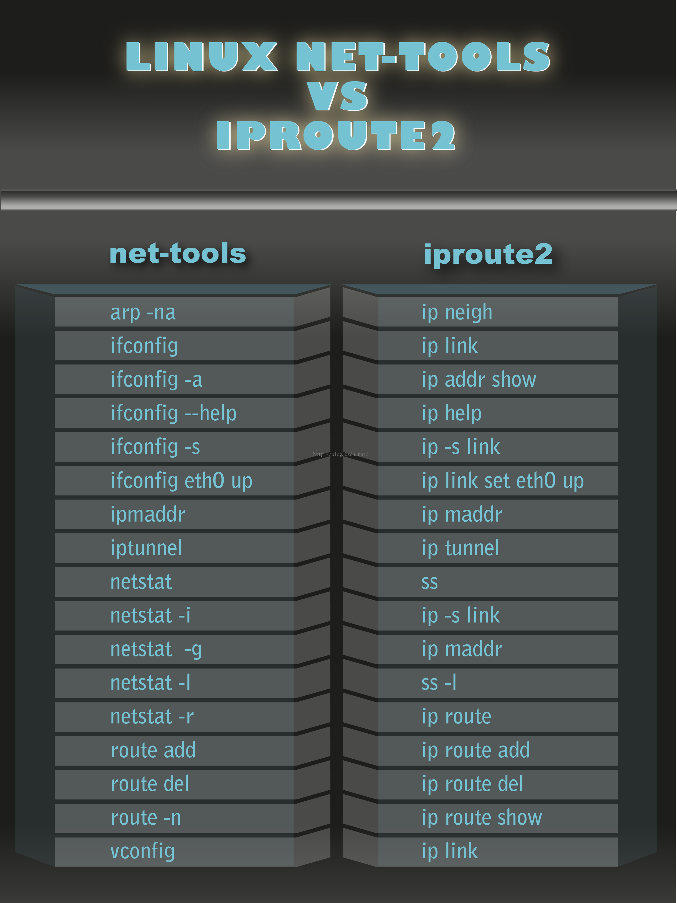
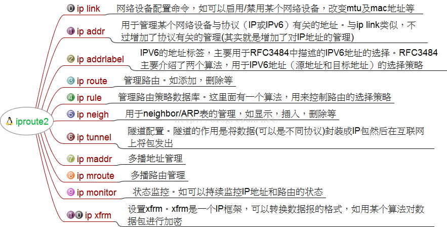

# 2.2 iproute2


## 背景介绍

iproute2是linux下管理控制TCP/IP网络和流量控制的新一代工具包，旨在替代老派的工具链net-tools，即大家比较熟悉的ifconfig，arp，route，netstat等命令。

两套工具本质的区别是:net-tools是通过procfs(/proc)和ioctl系统调用去访问和改变内核网络配置，而iproute2则通过netlink套接字接口与内核通讯。

net-tools的用法给人的感觉是比较乱，而iproute2的用户接口相对net-tools来说相对来说，更加直观。比如，各种网络资源（如link、IP地址、路由和隧道等）均使用合适的对象抽象去定义，使得用户可使用一致的语法去管理不同的对象。而且自2001年起，Linux社区已经对其停止维护。同时，一些Linux发行版比如Arch Linux和CentOS/RHEL 7则已经完全抛弃了net-tools，只支持iproute2。

我们先粗略看一下两个网络管理工具包对应的命令：




## ip命令

iproute2的核心就是ip命令，我们先来看一下ip命令的用法：

```bash
Usage: ip [ OPTIONS ] OBJECT { COMMAND | help }
       ip [ -force ] -batch filename
where  OBJECT := { link | address | addrlabel | route | rule | neigh | ntable |
                   tunnel | tuntap | maddress | mroute | mrule | monitor | xfrm |
                   netns | l2tp | macsec | tcp_metrics | token }
       OPTIONS := { -V[ersion] | -s[tatistics] | -d[etails] | -r[esolve] |
                    -h[uman-readable] | -iec |
                    -f[amily] { inet | inet6 | ipx | dnet | bridge | link } |
                    -4 | -6 | -I | -D | -B | -0 |
                    -l[oops] { maximum-addr-flush-attempts } |
                    -o[neline] | -t[imestamp] | -ts[hort] | -b[atch] [filename] |
                    -rc[vbuf] [size] | -n[etns] name | -a[ll] }

```


### ip link  

> 网络设备的配置命令，启用，禁用设备,改变设备其他状态如MTU(Maximum Transmission Unit)以及mac地址等  

查看所有网络接口

```bash
[root@192 ~]$ ip link show
1: lo: <LOOPBACK,UP,LOWER_UP> mtu 65536 qdisc noqueue state UNKNOWN mode DEFAULT qlen 1
    link/loopback 00:00:00:00:00:00 brd 00:00:00:00:00:00
2: ens33: <BROADCAST,MULTICAST,UP,LOWER_UP> mtu 1500 qdisc pfifo_fast state UP mode DEFAULT qlen 1000
    link/ether 00:0c:29:f8:b2:15 brd ff:ff:ff:ff:ff:ff
3: virbr0: <NO-CARRIER,BROADCAST,MULTICAST,UP> mtu 1500 qdisc noqueue state DOWN mode DEFAULT qlen 1000
    link/ether 52:54:00:38:8c:73 brd ff:ff:ff:ff:ff:ff
4: virbr0-nic: <BROADCAST,MULTICAST> mtu 1500 qdisc pfifo_fast master virbr0 state DOWN mode DEFAULT qlen 1000
    link/ether 52:54:00:38:8c:73 brd ff:ff:ff:ff:ff:ff
```
查看特定网络接口

```bash
[root@192 ~]$ ip link show ens33
2: ens33: <BROADCAST,MULTICAST,UP,LOWER_UP> mtu 1500 qdisc pfifo_fast state UP mode DEFAULT qlen 1000
    link/ether 00:0c:29:f8:b2:15 brd ff:ff:ff:ff:ff:ff
```
查看详细信息

```
[root@192 ~]$ ip -s link show ens33
2: ens33: <BROADCAST,MULTICAST,UP,LOWER_UP> mtu 1500 qdisc pfifo_fast state UP mode DEFAULT qlen 1000
    link/ether 00:0c:29:f8:b2:15 brd ff:ff:ff:ff:ff:ff
    RX: bytes  packets  errors  dropped overrun mcast   
    6325172    5042     0       0       0       0       
    TX: bytes  packets  errors  dropped carrier collsns 
    170683     2165     0       0       0       0 
```
查看更详细的信息

```
[root@192 ~]$ ip -s -s link show ens33
2: ens33: <BROADCAST,MULTICAST,UP,LOWER_UP> mtu 1500 qdisc pfifo_fast state UP mode DEFAULT qlen 1000
    link/ether 00:0c:29:f8:b2:15 brd ff:ff:ff:ff:ff:ff
    RX: bytes  packets  errors  dropped overrun mcast   
    461629269  308345   0       0       0       0       
    RX errors: length   crc     frame   fifo    missed
               0        0       0       0       0       
    TX: bytes  packets  errors  dropped carrier collsns 
    4650285    75986    0       0       0       0       
    TX errors: aborted  fifo   window heartbeat transns
               0        0       0       0       4 
```

只查看激活状态的网络接口

```
[root@192 ~]$ ip link show up
1: lo: <LOOPBACK,UP,LOWER_UP> mtu 65536 qdisc noqueue state UNKNOWN mode DEFAULT qlen 1
    link/loopback 00:00:00:00:00:00 brd 00:00:00:00:00:00
2: ens33: <BROADCAST,MULTICAST,UP,LOWER_UP> mtu 1500 qdisc pfifo_fast state UP mode DEFAULT qlen 1000
    link/ether 00:0c:29:f8:b2:15 brd ff:ff:ff:ff:ff:ff
3: virbr0: <NO-CARRIER,BROADCAST,MULTICAST,UP> mtu 1500 qdisc noqueue state DOWN mode DEFAULT qlen 1000
    link/ether 52:54:00:38:8c:73 brd ff:ff:ff:ff:ff:ff
```
激活或停用某个网络接口

```
[root@192 ~]$ sudo ip link set down ens33

[root@192 ~]$ ip link show up
1: lo: <LOOPBACK,UP,LOWER_UP> mtu 65536 qdisc noqueue state UNKNOWN mode DEFAULT qlen 1
    link/loopback 00:00:00:00:00:00 brd 00:00:00:00:00:00
3: virbr0: <NO-CARRIER,BROADCAST,MULTICAST,UP> mtu 1500 qdisc noqueue state DOWN mode DEFAULT qlen 1000
    link/ether 52:54:00:38:8c:73 brd ff:ff:ff:ff:ff:ff
[root@192 ~]$ sudo ip link set up ens33
[root@192 ~]$ ip link show up
1: lo: <LOOPBACK,UP,LOWER_UP> mtu 65536 qdisc noqueue state UNKNOWN mode DEFAULT qlen 1
    link/loopback 00:00:00:00:00:00 brd 00:00:00:00:00:00
2: ens33: <BROADCAST,MULTICAST,UP,LOWER_UP> mtu 1500 qdisc pfifo_fast state UP mode DEFAULT qlen 1000
    link/ether 00:0c:29:f8:b2:15 brd ff:ff:ff:ff:ff:ff
3: virbr0: <NO-CARRIER,BROADCAST,MULTICAST,UP> mtu 1500 qdisc noqueue state DOWN mode DEFAULT qlen 1000
    link/ether 52:54:00:38:8c:73 brd ff:ff:ff:ff:ff:ff
```
设置指定网络接口的MTU

```
[root@192 ~]$ sudo ip link set ens33 mtu 1500
```
改变网卡MAC地址（**必须先关闭网卡再设置**）
```
[root@192 ~]$ sudo ip link set down ens33 
[root@192 ~]$ sudo ip link set dev ens33 address 00:0c:29:f8:b2:15
[root@192 ~]$ sudo ip link set up ens33 
```
### ip addr  

>配置网络设备的IPv4或IPv6地址  

显示所有网络接口的ip地址
```
[root@192 ~]$ ip addr show 
1: lo: <LOOPBACK,UP,LOWER_UP> mtu 65536 qdisc noqueue state UNKNOWN qlen 1
    link/loopback 00:00:00:00:00:00 brd 00:00:00:00:00:00
    inet 127.0.0.1/8 scope host lo
       valid_lft forever preferred_lft forever
    inet6 ::1/128 scope host 
       valid_lft forever preferred_lft forever
2: ens33: <BROADCAST,MULTICAST,UP,LOWER_UP> mtu 1500 qdisc pfifo_fast state UP qlen 1000
    link/ether 00:0c:29:f8:b2:15 brd ff:ff:ff:ff:ff:ff
    inet 192.168.109.137/24 brd 192.168.109.255 scope global dynamic ens33
       valid_lft 1550sec preferred_lft 1550sec
    inet6 fe80::3d1a:3186:cc97:4e80/64 scope link 
       valid_lft forever preferred_lft forever
3: virbr0: <NO-CARRIER,BROADCAST,MULTICAST,UP> mtu 1500 qdisc noqueue state DOWN qlen 1000
    link/ether 52:54:00:38:8c:73 brd ff:ff:ff:ff:ff:ff
    inet 192.168.122.1/24 brd 192.168.122.255 scope global virbr0
       valid_lft forever preferred_lft forever
4: virbr0-nic: <BROADCAST,MULTICAST> mtu 1500 qdisc pfifo_fast master virbr0 state DOWN qlen 1000
    link/ether 52:54:00:38:8c:73 brd ff:ff:ff:ff:ff:ff
```
增加/删除地址(若配置IPv6地址，加上 -6)
```
[root@192 ~]$ sudo ip addr add 192.168.10.10/24 dev ens33
[root@192 ~]$ ip addr show ens33
2: ens33: <BROADCAST,MULTICAST,UP,LOWER_UP> mtu 1500 qdisc pfifo_fast state UP qlen 1000
    link/ether 00:0c:29:f8:b2:15 brd ff:ff:ff:ff:ff:ff
    inet 192.168.109.137/24 brd 192.168.109.255 scope global dynamic ens33
       valid_lft 1065sec preferred_lft 1065sec
    inet 192.168.10.10/24 scope global ens33
       valid_lft forever preferred_lft forever
    inet6 fe80::3d1a:3186:cc97:4e80/64 scope link 
       valid_lft forever preferred_lft forever
[root@192 ~]$ sudo ip addr del 192.168.10.10/24 dev ens33
[root@192 ~]$ ip addr show ens33
2: ens33: <BROADCAST,MULTICAST,UP,LOWER_UP> mtu 1500 qdisc pfifo_fast state UP qlen 1000
    link/ether 00:0c:29:f8:b2:15 brd ff:ff:ff:ff:ff:ff
    inet 192.168.109.137/24 brd 192.168.109.255 scope global dynamic ens33
       valid_lft 1769sec preferred_lft 1769sec
    inet6 fe80::3d1a:3186:cc97:4e80/64 scope link 
       valid_lft forever preferred_lft forever

```
### ip addrlabel  

> IPv6地址标签，主要用于RFC3483中描述的IPv6地址的选择，RFC3484主要介绍了两个算法，用于IPv6地址（源地址和目标地址）的选择策略  

### ip route  

> 路由表管理  

查看路由表
```
[root@192 ~]$ ip route show
default via 192.168.109.2 dev ens33  proto static  metric 100 
192.168.109.0/24 dev ens33  proto kernel  scope link  src 192.168.109.137  metric 100 
192.168.122.0/24 dev virbr0  proto kernel  scope link  src 192.168.122.1 
```
查看指定设备路由表
```
[root@192 ~]$ ip route show dev ens33
default via 192.168.109.2  proto static  metric 100 
192.168.109.0/24  proto kernel  scope link  src 192.168.109.137  metric 100 
```
修改默认路由(添加新的默认路由、删除旧的默认路由，或者使用replace)
```
[root@192 ~]$ ip route add default via xxx.xxx.xxx.xxx/xx
[root@192 ~]$ ip route del default via xxx.xxx.xxx.xxx/xx
```
添加/删除静态路由
```
[root@192 ~]$ ip route add xxx.xxx.xxx.xxx/xx via xxx.xxx.xxx.xxx/xx dev ens33
[root@192 ~]$ ip route del xxx.xxx.xxx.xxx/xx
```
### ip rule  

> 管理路由策略数据库，里面有一个算法用来控制路由的选择策略  

```
通过路由表inr.ruhep路由来自源地址为192.203.80/24的数据包

　　ip ru add from 192.203.80/24 table inr.ruhep prio 220

把源地址为193.233.7.83的数据报的源地址转换为192.203.80.144，并通过表1进行路由

　　ip ru add from 193.233.7.83 nat 192.203.80.144 table 1 prio 320

删除无用的缺省规则 
    
    ip ru del prio 32767
```  

### ip neigh  

>邻居/ARP表的管理
```
# 显示arp表
ip neigh
10.10.105.254 dev eth0 lladdr 84:5b:12:32:57:f6 REACHABLE
```


```
# 在设备eth0上，为地址10.0.0.3添加一个permanent ARP条目： 

    ip neigh add 10.0.0.3 lladdr 0:0:0:0:0:1 dev eth0 nud perm 

# 把状态改为reachable 

    ip neigh chg 10.0.0.3 dev eth0 nud reachable

# 删除设备eth0上的一个ARP条目10.0.0.3 

    ip neigh del 10.0.0.3 dev eth0
```  

### ip ntable  

>邻居表配置  

### ip tunnel  
 
>隧道配置，隧道的作用是将数据（可以是不同协议）封装成IP包然后在互联网上将包发出  

```
建立一个点对点通道，最大TTL是32 

    ip tunnel add Cisco mode sit remote 192.31.7.104 local 
192.203.80.1 ttl 32 
```
### ip tuntap  

>管理TUN/TAP设备  

### ip maddr  

>多播地址管理

```
$ sudo ip maddr add 33:44:00:00:00:01 dev eth0
$ sudo ip maddr del 33:44:00:00:00:01 dev eth0
$ ip maddr list dev eth0
```  

### ip mroute  

>多播路由缓存管理  

### ip mrule  

>多播路由策略数据库的规则  

### ip monitor  

>状态监控，如可以持续监控ip地址和路由的状态  

```
    ip monitor file FILENAME
```
### ip xfrm  

>XFRM框架实现IP层处理和IPSec处理,可以转换数据包格式，如对某个数据包进行加密  

### ip netns  

>进程网络namespace管理  

netns是在Linux中提供网络虚拟化的一个项目，使用netns网络空间虚拟化可以在本地虚拟化出多个网络环境，目前netns在lxc容器中被用来为容器提供网络。

使用netns创建的网络空间独立于当前系统的网络空间，其中的网络设备以及iptables规则等都是独立的，就好像进入了另外一个网络一样。  

```
创建虚拟网络空间

    ip netns add ns1
    
进入ns1内部的sh

    ip netns exec ns1 bash

退出输入exit

[root@192 root]# ip netns add sh1
[root@192 root]# ip netns show
sh1
[root@192 root]# ip netns exec sh1 bash
[root@192 root]# ip link show
1: lo: <LOOPBACK> mtu 65536 qdisc noop state DOWN mode DEFAULT qlen 1
    link/loopback 00:00:00:00:00:00 brd 00:00:00:00:00:00
```
两个namespace的网络想要联络需要veth设备，首先在其中一个命名空间创建一对设备，再将其中一个甩到目标namespace中
```
[root@192 root]# ip link add veth0 type veth peer name veth1
[root@192 root]# ip link show
1: lo: <LOOPBACK,UP,LOWER_UP> mtu 65536 qdisc noqueue state UNKNOWN mode DEFAULT qlen 1
    link/loopback 00:00:00:00:00:00 brd 00:00:00:00:00:00
2: ens33: <BROADCAST,MULTICAST,UP,LOWER_UP> mtu 1500 qdisc pfifo_fast state UP mode DEFAULT qlen 1000
    link/ether 00:0c:29:f8:b2:15 brd ff:ff:ff:ff:ff:ff
3: virbr0: <NO-CARRIER,BROADCAST,MULTICAST,UP> mtu 1500 qdisc noqueue state DOWN mode DEFAULT qlen 1000
    link/ether 52:54:00:38:8c:73 brd ff:ff:ff:ff:ff:ff
4: virbr0-nic: <BROADCAST,MULTICAST> mtu 1500 qdisc pfifo_fast master virbr0 state DOWN mode DEFAULT qlen 1000
    link/ether 52:54:00:38:8c:73 brd ff:ff:ff:ff:ff:ff
5: veth1@veth0: <BROADCAST,MULTICAST,M-DOWN> mtu 1500 qdisc noop state DOWN mode DEFAULT qlen 1000
    link/ether da:b6:69:cf:cb:ab brd ff:ff:ff:ff:ff:ff
6: veth0@veth1: <BROADCAST,MULTICAST,M-DOWN> mtu 1500 qdisc noop state DOWN mode DEFAULT qlen 1000
    link/ether 6e:d1:5c:c0:83:c3 brd ff:ff:ff:ff:ff:ff
[root@192 root]# ip link set veth1 netns sh1
[root@192 root]# ip link show
1: lo: <LOOPBACK,UP,LOWER_UP> mtu 65536 qdisc noqueue state UNKNOWN mode DEFAULT qlen 1
    link/loopback 00:00:00:00:00:00 brd 00:00:00:00:00:00
2: ens33: <BROADCAST,MULTICAST,UP,LOWER_UP> mtu 1500 qdisc pfifo_fast state UP mode DEFAULT qlen 1000
    link/ether 00:0c:29:f8:b2:15 brd ff:ff:ff:ff:ff:ff
3: virbr0: <NO-CARRIER,BROADCAST,MULTICAST,UP> mtu 1500 qdisc noqueue state DOWN mode DEFAULT qlen 1000
    link/ether 52:54:00:38:8c:73 brd ff:ff:ff:ff:ff:ff
4: virbr0-nic: <BROADCAST,MULTICAST> mtu 1500 qdisc pfifo_fast master virbr0 state DOWN mode DEFAULT qlen 1000
    link/ether 52:54:00:38:8c:73 brd ff:ff:ff:ff:ff:ff
6: veth0@if5: <BROADCAST,MULTICAST> mtu 1500 qdisc noop state DOWN mode DEFAULT qlen 1000
    link/ether 6e:d1:5c:c0:83:c3 brd ff:ff:ff:ff:ff:ff link-netnsid 0
[root@192 root]# ip netns exec sh1 bash
[root@192 root]# ip link sh
1: lo: <LOOPBACK> mtu 65536 qdisc noop state DOWN mode DEFAULT qlen 1
    link/loopback 00:00:00:00:00:00 brd 00:00:00:00:00:00
5: veth1@if6: <BROADCAST,MULTICAST> mtu 1500 qdisc noop state DOWN mode DEFAULT qlen 1000
    link/ether da:b6:69:cf:cb:ab brd ff:ff:ff:ff:ff:ff link-netnsid 0
```
完成上述步骤后可以看到他们设备名后面指向peer在另一个namespace中的序号，下面来看如何利用这一对设备进行通信
```
[root@192 root]# ip addr add 10.1.1.2/24 dev veth0
[root@192 root]# ip netns exec sh1 ip addr add 10.1.1.1/24 dev veth1
[root@192 root]# ip link set up veth0
[root@192 root]# ip netns exec sh1 ip link set up veth1
[root@192 root]# ping 10.1.1.1
PING 10.1.1.1 (10.1.1.1) 56(84) bytes of data.
64 bytes from 10.1.1.1: icmp_seq=1 ttl=64 time=0.070 ms
64 bytes from 10.1.1.1: icmp_seq=2 ttl=64 time=0.039 ms
64 bytes from 10.1.1.1: icmp_seq=3 ttl=64 time=0.037 ms
^C
--- 10.1.1.1 ping statistics ---
3 packets transmitted, 3 received, 0% packet loss, time 2000ms
rtt min/avg/max/mdev = 0.037/0.048/0.070/0.017 ms
```
注意点是分配好ip后别忘了set up
### ip l2tp  

>tunnel Ethernet over IP（L2TPv3）  

### ip tcp_metrics  

>管理TCP Metrics  

### ip token  

>标记化的接口标识符支持  

## ss命令

用法  

```
Usage: ss [ OPTIONS ]
       ss [ OPTIONS ] [ FILTER ]
          -h, --help          this message
   -V, --version       output version information
   -n, --numeric       don't resolve service names
   -r, --resolve       resolve host names
   -a, --all           display all sockets
   -l, --listening     display listening sockets
   -o, --options       show timer information
   -e, --extended      show detailed socket information
   -m, --memory        show socket memory usage
   -p, --processes     show process using socket
   -i, --info          show internal TCP information
   -s, --summary       show socket usage summary
   -b, --bpf           show bpf filter socket information
   -Z, --context       display process SELinux security contexts
   -z, --contexts      display process and socket SELinux security contexts
   -N, --net           switch to the specified network namespace name

   -4, --ipv4          display only IP version 4 sockets
   -6, --ipv6          display only IP version 6 sockets
   -0, --packet        display PACKET sockets
   -t, --tcp           display only TCP sockets
   -u, --udp           display only UDP sockets
   -d, --dccp          display only DCCP sockets
   -w, --raw           display only RAW sockets
   -x, --unix          display only Unix domain sockets
   -f, --family=FAMILY display sockets of type FAMILY

   -A, --query=QUERY, --socket=QUERY
       QUERY := {all|inet|tcp|udp|raw|unix|unix_dgram|unix_stream|unix_seqpacket|packet|netlink}[,QUERY]

   -D, --diag=FILE     Dump raw information about TCP sockets to FILE
   -F, --filter=FILE   read filter information from FILE
       FILTER := [ state STATE-FILTER ] [ EXPRESSION ]
       STATE-FILTER := {all|connected|synchronized|bucket|big|TCP-STATES}
         TCP-STATES := {established|syn-sent|syn-recv|fin-wait-{1,2}|time-wait|closed|close-wait|last-ack|listen|closing}
          connected := {established|syn-sent|syn-recv|fin-wait-{1,2}|time-wait|close-wait|last-ack|closing}
       synchronized := {established|syn-recv|fin-wait-{1,2}|time-wait|close-wait|last-ack|closing}
             bucket := {syn-recv|time-wait}
                big := {established|syn-sent|fin-wait-{1,2}|closed|close-wait|last-ack|listen|closing}
```

## 参考文档

* [1] http://blog.jobbole.com/97270/
* [2] http://blog.csdn.net/astrotycoon/article/details/52317288
