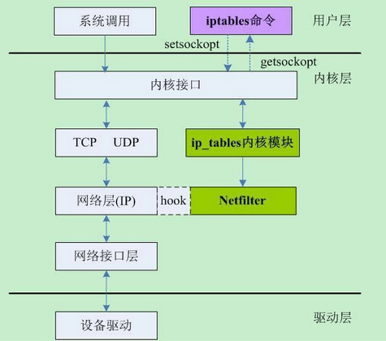
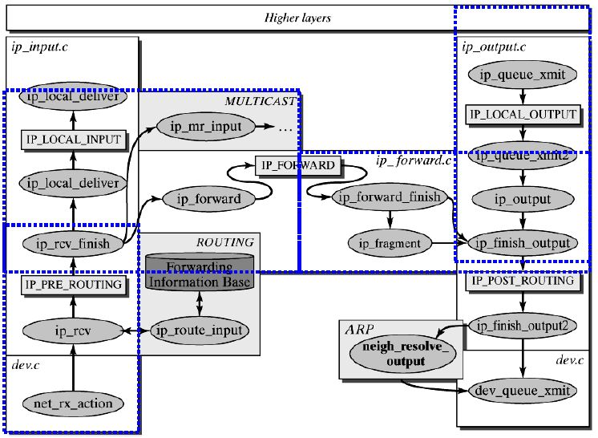

# 2.6 iptables

## netfilter/iptables总体架构

Netfilter是由Rusty Russell提出的Linux 2.4 内核防火墙框架，该框架既简洁又灵活，可实现安全策略应用中的许多功能，如数据包过滤、数据包处理、地址伪装、透明代理、动态网络地址转换(Network Address Translation，NAT)，以及基于用户及媒体访问控制(Media Access Control，MAC)地址的过滤和基于状态的过滤、包速率限制等。 我们应该知道主机之间的通信是数据流，是按照TCP/IP协议栈来包装的数据，netfilter就是通过识别每一层功能中的数据是否符合我们定义的规则，从而达到监控，修改，丢弃，转发的目录。


Netfilter所设置的规则是存放在内核内存中的，而 iptables 是一个应用层的应用程序，它通过 Netfilter 放出的接口来对存放在内核内存中的 XXtables（Netfilter的配置表）进行修改。这个XXtables由表tables、链chains、规则rules组成，iptables在应用层负责修改这个规则文件。类似的应用程序还有firewalld。



### Netfilter的HOOK机制

Netfilter的通用框架不依赖于具体的协议，而是为每种网络协议定义一套HOOK函数。这些HOOK函数在数据报经过协议栈的几个关键点时被调用，在这几个点中，协议栈将数据报及HOOK函数标号作为参数，传递给Netfilter框架。对于它在网络堆栈中增加的这些HOOK，内核的任何模块可以对每种协议的一个或多个HOOK进行注册，实现挂接。这样当某个数据报被传递给Netfilter框架时，内核能检测到是否有任何模块对该协议和HOOK函数进行了注册。若注册了，则调用该模块的注册时使用的回调函数，这样这些模块就有机会检查、修改、丢弃该数据报及指示Netfilter将该数据报传入用户空间的队列。这样，HOOK提供了一种方便的机制：在数据报通过Linux内核的不同位置上截获和操作处理数据报。这5个挂载点分别是PRE_ROUTING、INPUT、OUTPUT、FORWARD、POST_ROUTING。

挂载点具体位置如下图：


### 四表五链

Netfilter主要通过表tables、链chains、规则rules组成，可以说Netfilter是表的容器，表是链的容器，链是规则的容器，最终形成对数据报处理规则的实现。如下图所示：


四表：
- filter：过滤，防火墙；
- nat：地址转换nerwork address translation
- mangle：拆解报文，做出修改，封装报文
- raw：关闭nat表示启用的连接追踪功能（此功能非常消耗CPU）

> 表优先级：raw>mangle>nat>filter

五链：
- PREROUTING-->路由前
- INPUT-->输入一段
- FORWARD-->由本机转发
- OUTPUT-->本机内部发出
- POSTROUTING-->离开本机最后一条链

每个功能表上会内置不同的链：
- filter（过滤）:INPUT,FORWARD,OUTPUT
- nat（地址转换）:PERROUTING(DNAT),OUTPUT,POSTROUTING(SNAT)
- mangle(拆解报文，做出修改，封装报文):PEROUTING,INPUT,FORWARD,OUTPUT,- POSTROUTING
- raw(关闭nat表示启用的连接追踪功能)：PREROUTING,OUTPUT

## 规则表tables

1、filter表

主要用于对数据包进行过滤，根据具体的规则决定是否放行该数据包（如DROP、ACCEPT、REJECT、LOG）。filter表对应的内核模块为 iptable_filter，包含三个规则链：INPUT、FORWARD、OUTPUT。

2、nat表

主要用于修改数据包的IP地址、端口等信息（网络地址转换，如SNAT、DNAT、MASQUERADE、REDIRECT）。属于一个流的包（因为包的大小限制导致数据可能会被分成多个数据包）只会经过这个表一次。如果第一个包被允许做NAT或Masqueraded，那么余下的包都会自动地被做相同的操作，也就是说，余下的包不会再通过这个表。表对应的内核模块为iptable_nat，包含三个链：PREROUTING、OUTPUT、 POSTROUTING。

3、mangle表

主要用于修改数据包的TOS（Type Of Service，服务类型）、TTL（Time To Live，生存周期）以及为数据包设置Mark标记，以实现Qos(Quality Of Service，服务质量)调整以及策略路由等应用，由于需要相应的路由设备支持，因此应用并不广泛。包含五个规则链：PREROUTING、POSTROUTING、INPUT、OUTPUT、FORWARD。

4、raw表

是自1.2.9以后版本的iptables新增的表，主要用于决定数据包是否被状态跟踪机制处理。在匹配数据包时，raw表的规则要优先于其他表。包含两条规则链：OUTPUT、PREROUTING。


iptables中数据包4种被跟踪连接的状态：

NEW：该包想要开始一个连接（重新连接或将连接重定向）

RELATED：该包是属于某个已经建立的连接所建立的新连接。例如：FTP的数据传输连接就是控制连接所 RELATED出来的连接。--icmp-type 0 ( ping 应答) 就是--icmp-type 8 (ping 请求)所RELATED出来的。

ESTABLISHED ：只要发送并接到应答，一个数据连接从NEW变为ESTABLISHED,而且该状态会继续匹配这个连接的后续数据包。

INVALID：数据包不能被识别属于哪个连接或没有任何状态比如内存溢出，收到不知属于哪个连接的ICMP错误信息，一般应该DROP这个状态的任何数据。

## 规则链chains

在处理各种数据包时，根据防火墙规则的不同介入时机，iptables供涉及5种默认规则链，从应用时间点的角度理解这些链：

INPUT链：当接收到防火墙本机地址的数据包（入站）时，应用此链中的规则。

OUTPUT链：当防火墙本机向外发送数据包（出站）时，应用此链中的规则。

FORWARD链：当接收到需要通过防火墙发送给其他地址的数据包（转发）时，应用此链中的规则。

PREROUTING链：在对数据包作路由选择之前，应用此链中的规则，如DNAT。

POSTROUTING链：在对数据包作路由选择之后，应用此链中的规则，如SNAT。

其中中INPUT、OUTPUT链更多的应用在“主机防火墙”中，即主要针对服务器本机进出数据的安全控制；而FORWARD、PREROUTING、POSTROUTING链更多的应用在“网络防火墙”中，特别是防火墙服务器作为网关使用时的情况。

## 规则rules
组成部分：报文的匹配条件和匹配到之后处理动作两部分组成。

常见的处理动作：

ACCEPT：允许数据包通过

DROP：直接丢弃数据包，不给任何回应信息

REJECT：拒绝数据包通过，必要时会给数据发送端一个响应的信息。

SNAT：源地址转换。在进入路由层面的route之后，出本地的网络栈之前，改写源地址，目标地址不变，并在本机建立NAT表项，当数据返回时，根据NAT表将目的地址数据改写为数据发送出去时候的源地址，并发送给主机。解决内网用户用同一个公网地址上网的问题。MASQUERADE，是SNAT的一种特殊形式，适用于像 adsl这种临时会变的ip上。

DNAT：目标地址转换。和SNAT相反，IP包经过route之前，重新修改目标地址，源地址不变，在本机建立NAT表项，当数据返回时，根据NAT表将源地址修改为数据发送过来时的目标地址，并发给远程主机。可以隐藏后端服务器的真实地址。

REDIRECT：是DNAT的一种特殊形式，将网络包转发到本地host上（不管IP头部指定的目标地址是啥），方便在本机做端口转发。

LOG：在/var/log/messages文件中记录日志信息，然后将数据包传递给下一条规则

除去最后一个LOG，前3条规则匹配数据包后，该数据包不会再往下继续匹配了，所以编写的规则顺序极其关键。

## iptables命令格式


[-t 表名]：该规则所操作的哪个表，可以使用filter、nat等，如果没有指定则默认为filter

-A：新增一条规则，到该规则链列表的最后一行

-I：插入一条规则，原本该位置上的规则会往后顺序移动，没有指定编号则为1

-D：从规则链中删除一条规则，要么输入完整的规则，或者指定规则编号加以删除

-R：替换某条规则，规则替换不会改变顺序，而且必须指定编号。

-P：设置某条规则链的默认动作

-nL：-L、-n，查看当前运行的防火墙规则列表

-F：清空所选链。这等于把所有规则一个个的删除。

chain名：指定规则表的哪个链，如INPUT、OUPUT、FORWARD、PREROUTING等

[规则编号]：插入、删除、替换规则时用，--line-numbers显示号码

[-i|o 网卡名称]：i是指定数据包从哪块网卡进入，o是指定数据包从哪块网卡输出

[-p 协议类型]：可以指定规则应用的协议，包含tcp、udp和icmp等

[-s 源IP地址]：源主机的IP地址或子网地址

[--sport 源端口号]：数据包的IP的源端口号

[-d目标IP地址]：目标主机的IP地址或子网地址

[--dport目标端口号]：数据包的IP的目标端口号

-m：extend matches，这个选项用于提供更多的匹配参数，如：

         -m state –state ESTABLISHED,RELATED

         -m tcp –dport 22

         -m multiport –dports 80,8080

         -m icmp –icmp-type 8

<-j 动作>：处理数据包的动作，包括ACCEPT、DROP、REJECT等

## iptables实例
iptables命令主要包括链管理和规则管理

### 链管理
- -F：flush，清空规则链，省略链表示清空指定表上所有的链；
- -N：new，创建新的自定义规则链；
```
        [root@localhost ~]# iptables -t filter -N IN_public
        [root@localhost ~]# iptables -L -n
        Chain INPUT (policy ACCEPT)
        target     prot opt source               destination         

        Chain FORWARD (policy ACCEPT)
        target     prot opt source               destination         

        Chain OUTPUT (policy ACCEPT)
        target     prot opt source               destination         

        Chain IN_public (0 references)
        target     prot opt source               destination
```
- -X：drop，删除用户自定义的规则链，必须是空链
```
        [root@localhost ~]# iptables -X IN_public
        [root@localhost ~]# iptables -L -n
        Chain INPUT (policy ACCEPT)
        target     prot opt source               destination         

        Chain FORWARD (policy ACCEPT)
        target     prot opt source               destination         

        Chain OUTPUT (policy ACCEPT)
        target     prot opt source               destination         
```

- -Z：zero，置零：置零规则计数器；
- -P：policy，为指定链设置默认处理策略；对filter表中的链而言，默认策略通常有accept（放行），drop（丢弃），reject（拒绝）
```
        [root@localhost init.d]# iptables -P FORWARD DROP
        [root@localhost init.d]# iptables -L -n
        Chain INPUT (policy ACCEPT)
        target     prot opt source               destination         

        Chain FORWARD (policy DROP)
        target     prot opt source               destination         

        Chain OUTPUT (policy ACCEPT)
        target     prot opt source               destination       
```
- -E：rename：重命名自定义链：引用计数器不为0的自定义链无法改名，也无法删除；
```
        [root@localhost ~]# iptables -E IN_public hello
        [root@localhost ~]# iptables -L -n
        Chain INPUT (policy ACCEPT)
        target     prot opt source               destination         

        Chain FORWARD (policy ACCEPT)
        target     prot opt source               destination         

        Chain OUTPUT (policy ACCEPT)
        target     prot opt source               destination         

        Chain hello (0 references)
        target     prot opt source               destination     
```

### 规则管理

        -A：append，将新规则追加于指定链的尾部；
        -I：insert，将新规则插入至指定链的指定位置；
        -D：delete，删除指定链上的指定规则；
            有两种指定方式：
            (1)指定匹配条件；
            (2)指定规则编号；
        -R:replace，替换指定链上的指定规则：
    查看：
        -L:list，列出指定链上的所有规则；
            -n：numberic，以数字格式显示地址和端口号；
            -v：verbose，显示详细信息
            --line-numbers：显示规则编号；
            -x：exactly，显示计数器计数结果的精确值；
    匹配条件：
        基本匹配：
            [!]-s,--src,--source IP|Netaddr:检查报文中源IP地址是否符合此处的指明的地址范围；
            [!]-d,--dst,--destination IP|Netaddr检查报文中源IP地址是否符合此处指定的地址范围；
            [!]-p,--protocol{tcp,udp,icmp}:检查报文中的协议，即ip首部中的protocols所标识的协议
            -i，--ininterface IFACE:数据报文的流入接口：仅能用于PREROUTING, INPUT及FORWARD链上；
            -o, --out-interface IFACE：数据报文的流出接口；仅能用于FORWARD, OUTPUT及POSTROUTING链上；
    目标：
        -j TARGET:jum至指定的TARGET
            ACCEPT:接受
            DROP:丢弃
            REJECT:拒绝
            RETURN:返回调用链
            REDIRECT:端口重定向
            LOG:记录日志
            MARK:做防火墙标记
            DNAT:目标地址转换
            SNAT：源地址转换
            MASQUERADE:地址伪装
            自定义链：由自定义链上的规则进行匹配检查


```
        例如：放行本机TCP协议
        [root@localhost ~]# iptables -t filter -A INPUT -d 172.16.0.46 -p tcp -j ACCEPT
        [root@localhost ~]# iptables -L -n
        Chain INPUT (policy ACCEPT)
        target     prot opt source               destination         
        ACCEPT     tcp  --  0.0.0.0/0            172.16.0.46         

        Chain FORWARD (policy ACCEPT)
        target     prot opt source               destination         

        Chain OUTPUT (policy ACCEPT)
        target     prot opt source               destination         
        [root@localhost ~]# iptables -t filter -A OUTPUT -s 172.16.0.46 -p tcp -j ACCEPT
        [root@localhost ~]# iptables -L -n -v
        Chain INPUT (policy ACCEPT 6 packets, 468 bytes)
         pkts bytes target     prot opt in     out     source               destination         
          203 14998 ACCEPT     tcp  --  *      *       0.0.0.0/0            172.16.0.46         

        Chain FORWARD (policy ACCEPT 0 packets, 0 bytes)
         pkts bytes target     prot opt in     out     source               destination         

        Chain OUTPUT (policy ACCEPT 0 packets, 0 bytes)
         pkts bytes target     prot opt in     out     source               destination         
           30  3168 ACCEPT     tcp  --  *      *       172.16.0.46          0.0.0.0/0 
    如果我将INPUT和OUTPUT关闭之后任然可以进行访问
    [root@localhost ~]# iptables -P INPUT DROP
    [root@localhost ~]# iptables -P OUTPUT DROP
    [root@localhost ~]# iptables -P FORWARD DROP
    [root@localhost ~]# iptables -L -n
    Chain INPUT (policy DROP)
    target     prot opt source               destination         
    ACCEPT     tcp  --  0.0.0.0/0            172.16.0.46         

    Chain FORWARD (policy DROP)
    target     prot opt source               destination         

    Chain OUTPUT (policy DROP)
    target     prot opt source               destination         
    ACCEPT     tcp  --  172.16.0.46          0.0.0.0/0           
```

扩展匹配：-m指明扩展匹配（指明扩展名）--spec_options

```
    例如：-m tcp --dport 22
    隐式扩展：对-p protocol指明的协议进行扩展,可省略-m选项；
        -p tcp
            --dport PORT[-PORT]:目标端口，可以是单个端口或连续多个端口
            --sport PORT[-PORT]:
            --tcp-flages:

        -p udp
        -p icmp
            --icmp-type
        例如本地可以ping通任意地址，而其他主机无法ping通
        ]# iptables -A INPUT -d 172.16.0.46 -p icmp --icmp-type 0 -j ACCEPT
        ]# iptables -A OUTPUT -s 172.16.0.46 -p icmp --icmp-type 8 -j ACCEPT
    
    root@localhost etc]# iptables -L -n
    Chain INPUT (policy DROP)
    target     prot opt source               destination         
    ACCEPT     tcp  --  0.0.0.0/0            172.16.0.46         tcp dpt:22 
    ACCEPT     tcp  --  0.0.0.0/0            172.16.0.46         tcp dpt:80 
    ACCEPT     icmp --  0.0.0.0/0            172.16.0.46         icmp type 0 
    ACCEPT     tcp  --  127.0.0.1            0.0.0.0/0           tcp spt:9000 
    ACCEPT     tcp  --  0.0.0.0/0            127.0.0.1           tcp dpt:9000 

    Chain FORWARD (policy ACCEPT)
    target     prot opt source               destination         

    Chain OUTPUT (policy DROP)
    target     prot opt source               destination         
    ACCEPT     tcp  --  172.16.0.46          0.0.0.0/0           tcp spt:22 
    ACCEPT     tcp  --  172.16.0.46          0.0.0.0/0           tcp spt:80 
    ACCEPT     icmp --  172.16.0.46          0.0.0.0/0           icmp type 8 
    ACCEPT     tcp  --  127.0.0.1            0.0.0.0/0           tcp spt:9000 
    ACCEPT     tcp  --  0.0.0.0/0            127.0.0.1           tcp dpt:9000 
```

显示扩展：必须使用-m选项指定使用的扩展

```
    1，multiport扩展
        以离散方式定义多端口匹配：最多匹配15个端口；
        ]# iptables -I INPUT -d 172.16.0.46 -p tcp -m multiport --dport 22,80 -j ACCEPT
        ]# iptables -I OUTPUT -s 172.16.0.46 -p tcp -m multiport --sport 22,80 -j ACCEPT

    2，iprange扩展
        指明连续的（但一般是不能扩展为整个网络）ip地址范围有效：
        [!] --src-range from[-to]：指明连续的源IP地址范围；
        [!] --dst-range from[-to]：指明连续的目标IP地址范围；
        ~]# iptables -I INPUT -d 172.16.100.9 -p tcp -m multiport --dports 22:23,80 -m iprange --src-range 172.16.100.1-172.16.100.120 -j ACCEPT
        ~]# iptables -I OUTPUT -s 172.16.100.9 -p tcp -m multiport --sports 22:23,80 -m iprange --dst-range 172.16.100.1-172.16.100.120 -j ACCEPT   

    3，string扩展
        检查报文中出现的字符串；
        ~]# iptables -I OUTPUT -m string --algo bm --string 'movie' -j REJECT

    4、time扩展
        根据报文到达的时间与指定的时间范围进行匹配；
        --datestart 
        --datestop
        --timestart
        --timestop
        --monthdays
        --weekdays
    5，state扩展
        根据连接追踪机制检查连接间的状态
        调整连接追踪功能所能够容纳的最大连接数量：
        /proc/sys/net/nf_conntrack_max

        已经追踪到并记录下的连接：
        /proc/net/nf_conntrack

        不同协议或连接类型追的时长：
        /proc/sys/net/netfilter/

        可追踪的连接状态：
            NEW：新发出的请求；连接追踪模板中不存此连接相关的信息条目，因此，将其识别为第一次发出的请求；
            ESTABLISHED：NEW状态之后，连接追踪模板中为其建立的条目失效之前期间内所进行的通信的状态；
            RELATED：相关的连接；如ftp协议的命令连接与数据连接之间的关系；
            INVALIED：无法识别的连接；
```
iptables的nat的功能
>需要开启linux的核心转发功能

    [root@ns1 ~]# sysctl -w net.ipv4.ip_forward=1
    net.ipv4.ip_forward = 1
    [root@ns1 ~]# cat /proc/sys/net/ipv4/ip_forward 
    1

    nat：
        SNAT:至修改请求报文的源地址；
        DNAT:至修改请求报文的目标地址；
        MASQUERADE:基于拨号的模式进行伪装

    nat表：
        PREROUTING：DNAT
        OUTPUT
        POSTROUTING：SNAT
    # iptables -t nat -A POSTROUTING -s 192.168.56.0/24 ! -d 192.168.56.0/24 -j SNAT --to-source 172.16.0.53


## 参考文档

* [1] http://blog.csdn.net/adamska0104/article/details/40820061
* [2] http://www.yduba.com/biancheng-9551851822.html
* [3] https://wiki.archlinux.org/index.php/Iptables_(%E7%AE%80%E4%BD%93%E4%B8%AD%E6%96%87)
* [4] http://www.178linux.com/59226
