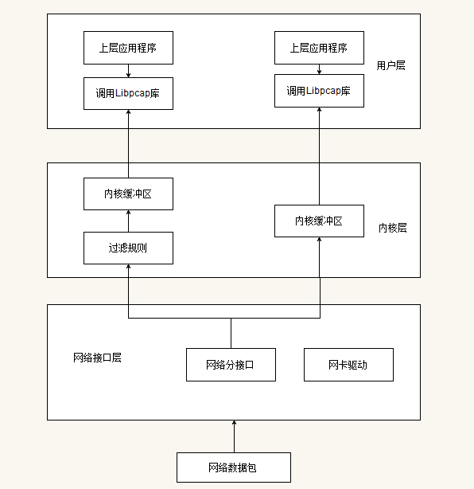

# 2.9 libpcap

libpcap（Packet Capture Library）即数据包捕获函数库，是Unix/Linux平台下的网络数据包捕获函数库。它是一个独立于系统的用户层包捕获的API接口，为底层网络监测提供了一个可移植的框架。著名的软件TCPDUMP就是在libpcap的的基础上开发而成的

libpcap可以实现以下功能：
- 数据包捕获：捕获流经网卡的原始数据包
- 自定义数据包发送：任何构造格式的原始数据包
- 流量采集与统计：网络采集的中流量信息
- 规则过滤：提供自带规则过滤功能，按需要选择过滤规则

## libpcap工作原理

libpcap主要由两部份组成：网络分接口(Network Tap)和数据过滤器(Packet Filter)。

网络分接口从网络设备驱动程序中收集数据拷贝（旁路机制），过滤器决定是否接收该数据包。Libpcap利用BSD Packet Filter(BPF)算法对网卡接收到的链路层数据包进行过滤。BPF算法的基本思想是在有BPF监听的网络中，网卡驱动将接收到的数据包复制一份交给BPF过滤器，过滤器根据用户定义的规则决定是否接收此数据包以及需要拷贝该数据包的那些内容，然后将过滤后的数据给与过滤器相关联的上层应用程序。如果没有定义规则，则把全部数据交给上层应用程序。



如图所示一个数据包的捕捉分为三个主要部分：
- 面向底层包捕获、
- 面向中间层的数据包过滤
- 面向应用层的用户接口


libpcap的包捕获机制就是在数据链路层加一个旁路处理。当一个数据包到达网络接口时，libpcap首先利用链路层PF_PACKET原始套接字从链路层驱动程序中获得该数据包的拷贝，再通过Tap函数将数据包发给BPF过滤器。BPF过滤器根据用户已经定义好的过滤规则对数据包进行逐一匹配，匹配成功则放入内核缓冲区，并传递给用户缓冲区，匹配失败则直接丢弃。如果没有设置过滤规则，所有数据包都将放入内核缓冲区，并传递给用户层缓冲区。所以整个过程并不干扰系统自身的网路协议栈的处理。

## libpcap使用流程

1. 决定对那一个接口进行嗅探，如eth0。我们也可以用一个字符串来定义这个设备。

2. 初始化pcap。使用文件句柄传入需要嗅探的设备。同时支持多个设备的嗅探。

3. 设置BPF. 创建一个规则集合，编译并且使用它。这个过程分为三个阶段: 1.规则集合被置于一个字符串内，并且被转换成能被pcap读的格式。2.编译该规则（就是调用一个不被外部程序使用的函数）。3.告诉pcap使用它来过滤数据包。

4. pcap进入它的主循环。在这个阶段内pcap一直工作到它接收了所有我们想要的包为止。每当它收到一个包（或者多个数据包）就调用另一个已经定义好的函数，这个函数可以做我们想要的任何工作，比如它可以剖析包的上层协议信息并给用户打印出结果，它可以将结果保存为一个文件，或者什么也不作。

5. 在嗅探到所需的数据后，我们要关闭会话并结束。

## tcpdump


## gopacket包

使用go语言的gopacket包可以非常容易地实现抓包，gopacket包构建在libpcap的之上。下面介绍下gopacket的常见用法。

```sh
# Get the gopacket package from GitHub
go get github.com/google/gopacket
# Pcap dev headers might be necessary
sudo apt-get install libpcap-dev
```

1. 获取所有的网络设备信息
```go
package main

import (
    "fmt"
    "log"
    "github.com/google/gopacket/pcap"
)

func main() {
    // Find all devices
    devices, err := pcap.FindAllDevs()
    if err != nil {
        log.Fatal(err)
    }

    // Print device information
    fmt.Println("Devices found:")
    for _, device := range devices {
        fmt.Println("\nName: ", device.Name)
        fmt.Println("Description: ", device.Description)
        fmt.Println("Devices addresses: ", device.Description)
        for _, address := range device.Addresses {
            fmt.Println("- IP address: ", address.IP)
            fmt.Println("- Subnet mask: ", address.Netmask)
        }
    }
}
```
2. 打开设备实时捕捉
```go
package main

import (
    "fmt"
    "github.com/google/gopacket"
    "github.com/google/gopacket/pcap"
    "log"
    "time"
)

var (
    device       string = "eth0"
    snapshot_len int32  = 1024
    promiscuous  bool   = false
    err          error
    timeout      time.Duration = 30 * time.Second
    handle       *pcap.Handle
)

func main() {
    // Open device
    handle, err = pcap.OpenLive(device, snapshot_len, promiscuous, timeout)
    if err != nil {log.Fatal(err) }
    defer handle.Close()

    // Use the handle as a packet source to process all packets
    packetSource := gopacket.NewPacketSource(handle, handle.LinkType())
    for packet := range packetSource.Packets() {
        // Process packet here
        fmt.Println(packet)
    }
}
```
3. 抓取结果保存为PCAP格式文件

我们必须使用gapacket/pcapgo包来输出pcap的格式文件。

```go
package main

import (
	"fmt"
	"os"
	"time"

	"github.com/google/gopacket"
	"github.com/google/gopacket/layers"
	"github.com/google/gopacket/pcap"
	"github.com/google/gopacket/pcapgo"
)

var (
	deviceName  string = "eth0"
	snapshotLen int32  = 1024
	promiscuous bool   = false
	err         error
	timeout     time.Duration = -1 * time.Second
	handle      *pcap.Handle
	packetCount int = 0
)

func main() {
	// Open output pcap file and write header 
	f, _ := os.Create("test.pcap")
	w := pcapgo.NewWriter(f)
	w.WriteFileHeader(snapshotLen, layers.LinkTypeEthernet)
	defer f.Close()

	// Open the device for capturing
	handle, err = pcap.OpenLive(deviceName, snapshotLen, promiscuous, timeout)
	if err != nil {
		fmt.Printf("Error opening device %s: %v", deviceName, err)
		os.Exit(1)
	}
	defer handle.Close()

	// Start processing packets
	packetSource := gopacket.NewPacketSource(handle, handle.LinkType())
	for packet := range packetSource.Packets() {
		// Process packet here
		fmt.Println(packet)
		w.WritePacket(packet.Metadata().CaptureInfo, packet.Data())
		packetCount++
		
		// Only capture 100 and then stop
		if packetCount > 100 {
			break
		}
	}
}
```

4. 读取PCAP格式文件来查看分析网络数据包

> 我们可以使用tcpdump创建的文件。
```go
# Capture packets to test.pcap file
sudo tcpdump -w test.pcap
package main

// Use tcpdump to create a test file
// tcpdump -w test.pcap
// or use the example above for writing pcap files

import (
    "fmt"
    "github.com/google/gopacket"
    "github.com/google/gopacket/pcap"
    "log"
)

var (
    pcapFile string = "test.pcap"
    handle   *pcap.Handle
    err      error
)

func main() {
    // Open file instead of device
    handle, err = pcap.OpenOffline(pcapFile)
    if err != nil { log.Fatal(err) }
    defer handle.Close()

    // Loop through packets in file
    packetSource := gopacket.NewPacketSource(handle, handle.LinkType())
    for packet := range packetSource.Packets() {
        fmt.Println(packet)
    }
}
```
5. 设置过滤器
```go
#只抓取TCP协议80端口的数据
package main

import (
    "fmt"
    "github.com/google/gopacket"
    "github.com/google/gopacket/pcap"
    "log"
    "time"
)

var (
    device       string = "eth0"
    snapshot_len int32  = 1024
    promiscuous  bool   = false
    err          error
    timeout      time.Duration = 30 * time.Second
    handle       *pcap.Handle
)

func main() {
    // Open device
    handle, err = pcap.OpenLive(device, snapshot_len, promiscuous, timeout)
    if err != nil {
        log.Fatal(err)
    }
    defer handle.Close()

    // Set filter
    var filter string = "tcp and port 80"
    err = handle.SetBPFFilter(filter)
    if err != nil {
        log.Fatal(err)
    }
    fmt.Println("Only capturing TCP port 80 packets.")

    packetSource := gopacket.NewPacketSource(handle, handle.LinkType())
    for packet := range packetSource.Packets() {
        // Do something with a packet here.
        fmt.Println(packet)
    }

}
```

6. 解码抓取的数据

我们可以使用原始数据包，并且可将其转换为已知格式。它与不同的层兼容，所以我们可以轻松访问以太网，IP和TCP层.layers包是进入库中新增的，在底层PCAP库中不可用。这是一个令人难以置信的有用的包，它是gopacket库的一部分。它允许我们容易地识别包是否包含特定类型的层。该代码示例将显示如何使用层包来查看数据包是以太网，IP和TCP，并轻松访问这些头文件中的元素。
查询有效载荷取决于所涉及的所有层。每个协议是不同的，必须相应地计算。这就是layer包的魅力所在。gopacket的作者花了时间为诸如以太网，IP，UDP和TCP等众多已知层创建了相应类型。有效载荷是应用层的一部分。

```go
package main

import (
    "fmt"
    "github.com/google/gopacket"
    "github.com/google/gopacket/layers"
    "github.com/google/gopacket/pcap"
    "log"
    "strings"
    "time"
)

var (
    device      string = "eth0"
    snapshotLen int32  = 1024
    promiscuous bool   = false
    err         error
    timeout     time.Duration = 30 * time.Second
    handle      *pcap.Handle
)

func main() {
    // Open device
    handle, err = pcap.OpenLive(device, snapshotLen, promiscuous, timeout)
    if err != nil {log.Fatal(err) }
    defer handle.Close()

    packetSource := gopacket.NewPacketSource(handle, handle.LinkType())
    for packet := range packetSource.Packets() {
        printPacketInfo(packet)
    }
}

func printPacketInfo(packet gopacket.Packet) {
    // Let's see if the packet is an ethernet packet
    ethernetLayer := packet.Layer(layers.LayerTypeEthernet)
    if ethernetLayer != nil {
        fmt.Println("Ethernet layer detected.")
        ethernetPacket, _ := ethernetLayer.(*layers.Ethernet)
        fmt.Println("Source MAC: ", ethernetPacket.SrcMAC)
        fmt.Println("Destination MAC: ", ethernetPacket.DstMAC)
        // Ethernet type is typically IPv4 but could be ARP or other
        fmt.Println("Ethernet type: ", ethernetPacket.EthernetType)
        fmt.Println()
    }

    // Let's see if the packet is IP (even though the ether type told us)
    ipLayer := packet.Layer(layers.LayerTypeIPv4)
    if ipLayer != nil {
        fmt.Println("IPv4 layer detected.")
        ip, _ := ipLayer.(*layers.IPv4)

        // IP layer variables:
        // Version (Either 4 or 6)
        // IHL (IP Header Length in 32-bit words)
        // TOS, Length, Id, Flags, FragOffset, TTL, Protocol (TCP?),
        // Checksum, SrcIP, DstIP
        fmt.Printf("From %s to %s\n", ip.SrcIP, ip.DstIP)
        fmt.Println("Protocol: ", ip.Protocol)
        fmt.Println()
    }

    // Let's see if the packet is TCP
    tcpLayer := packet.Layer(layers.LayerTypeTCP)
    if tcpLayer != nil {
        fmt.Println("TCP layer detected.")
        tcp, _ := tcpLayer.(*layers.TCP)

        // TCP layer variables:
        // SrcPort, DstPort, Seq, Ack, DataOffset, Window, Checksum, Urgent
        // Bool flags: FIN, SYN, RST, PSH, ACK, URG, ECE, CWR, NS
        fmt.Printf("From port %d to %d\n", tcp.SrcPort, tcp.DstPort)
        fmt.Println("Sequence number: ", tcp.Seq)
        fmt.Println()
    }

    // Iterate over all layers, printing out each layer type
    fmt.Println("All packet layers:")
    for _, layer := range packet.Layers() {
        fmt.Println("- ", layer.LayerType())
    }

    // When iterating through packet.Layers() above,
    // if it lists Payload layer then that is the same as
    // this applicationLayer. applicationLayer contains the payload
    applicationLayer := packet.ApplicationLayer()
    if applicationLayer != nil {
        fmt.Println("Application layer/Payload found.")
        fmt.Printf("%s\n", applicationLayer.Payload())

        // Search for a string inside the payload
        if strings.Contains(string(applicationLayer.Payload()), "HTTP") {
            fmt.Println("HTTP found!")
        }
    }

    // Check for errors
    if err := packet.ErrorLayer(); err != nil {
        fmt.Println("Error decoding some part of the packet:", err)
    }
}
```
7. 构造发送数据包

这个例子做了几件事情。首先将显示如何使用网络设备发送原始字节。这样就可以像串行连接一样使用它来发送数据。这对于真正的低层数据传输非常有用，但如果您想与应用程序进行交互，您应该构建可以识别该数据包的其他硬件和软件。接下来，它将显示如何使用以太网，IP和TCP层创建一个数据包。一切都是默认空的。要完成它，我们创建另一个数据包，但实际上填写了以太网层的一些MAC地址，IPv4的的一些IP地址和TCP层的端口号。你应该看到如何伪装数据包和仿冒网络设备.TCP层结构体具有可读取和可设置的SYN，FIN，ACK标志。这有助于操纵和模糊TCP三次握手，会话和端口扫描.pcap库提供了一种发送字节的简单方法，但gopacket中的图层可帮助我们为多层创建字节结构。
```go
package main

import (
    "github.com/google/gopacket"
    "github.com/google/gopacket/layers"
    "github.com/google/gopacket/pcap"
    "log"
    "net"
    "time"
)

var (
    device       string = "eth0"
    snapshot_len int32  = 1024
    promiscuous  bool   = false
    err          error
    timeout      time.Duration = 30 * time.Second
    handle       *pcap.Handle
    buffer       gopacket.SerializeBuffer
    options      gopacket.SerializeOptions
)

func main() {
    // Open device
    handle, err = pcap.OpenLive(device, snapshot_len, promiscuous, timeout)
    if err != nil {log.Fatal(err) }
    defer handle.Close()

    // Send raw bytes over wire
    rawBytes := []byte{10, 20, 30}
    err = handle.WritePacketData(rawBytes)
    if err != nil {
        log.Fatal(err)
    }

    // Create a properly formed packet, just with
    // empty details. Should fill out MAC addresses,
    // IP addresses, etc.
    buffer = gopacket.NewSerializeBuffer()
    gopacket.SerializeLayers(buffer, options,
        &layers.Ethernet{},
        &layers.IPv4{},
        &layers.TCP{},
        gopacket.Payload(rawBytes),
    )
    outgoingPacket := buffer.Bytes()
    // Send our packet
    err = handle.WritePacketData(outgoingPacket)
    if err != nil {
        log.Fatal(err)
    }

    // This time lets fill out some information
    ipLayer := &layers.IPv4{
        SrcIP: net.IP{127, 0, 0, 1},
        DstIP: net.IP{8, 8, 8, 8},
    }
    ethernetLayer := &layers.Ethernet{
        SrcMAC: net.HardwareAddr{0xFF, 0xAA, 0xFA, 0xAA, 0xFF, 0xAA},
        DstMAC: net.HardwareAddr{0xBD, 0xBD, 0xBD, 0xBD, 0xBD, 0xBD},
    }
    tcpLayer := &layers.TCP{
        SrcPort: layers.TCPPort(4321),
        DstPort: layers.TCPPort(80),
    }
    // And create the packet with the layers
    buffer = gopacket.NewSerializeBuffer()
    gopacket.SerializeLayers(buffer, options,
        ethernetLayer,
        ipLayer,
        tcpLayer,
        gopacket.Payload(rawBytes),
    )
    outgoingPacket = buffer.Bytes()
}
```
8. 更多的解码/构造数据包的例子

```go
package main

import (
    "fmt"
    "github.com/google/gopacket"
    "github.com/google/gopacket/layers"
)

func main() {
    // If we don't have a handle to a device or a file, but we have a bunch
    // of raw bytes, we can try to decode them in to packet information

    // NewPacket() takes the raw bytes that make up the packet as the first parameter
    // The second parameter is the lowest level layer you want to decode. It will
    // decode that layer and all layers on top of it. The third layer
    // is the type of decoding: default(all at once), lazy(on demand), and NoCopy
    // which will not create a copy of the buffer

    // Create an packet with ethernet, IP, TCP, and payload layers
    // We are creating one we know will be decoded properly but
    // your byte source could be anything. If any of the packets
    // come back as nil, that means it could not decode it in to
    // the proper layer (malformed or incorrect packet type)
    payload := []byte{2, 4, 6}
    options := gopacket.SerializeOptions{}
    buffer := gopacket.NewSerializeBuffer()
    gopacket.SerializeLayers(buffer, options,
        &layers.Ethernet{},
        &layers.IPv4{},
        &layers.TCP{},
        gopacket.Payload(payload),
    )
    rawBytes := buffer.Bytes()

    // Decode an ethernet packet
    ethPacket :=
        gopacket.NewPacket(
            rawBytes,
            layers.LayerTypeEthernet,
            gopacket.Default,
        )

    // with Lazy decoding it will only decode what it needs when it needs it
    // This is not concurrency safe. If using concurrency, use default
    ipPacket :=
        gopacket.NewPacket(
            rawBytes,
            layers.LayerTypeIPv4,
            gopacket.Lazy,
        )

    // With the NoCopy option, the underlying slices are referenced
    // directly and not copied. If the underlying bytes change so will
    // the packet
    tcpPacket :=
        gopacket.NewPacket(
            rawBytes,
            layers.LayerTypeTCP,
            gopacket.NoCopy,
        )

    fmt.Println(ethPacket)
    fmt.Println(ipPacket)
    fmt.Println(tcpPacket)
}

```
9. 自定义协议

使用gopacket layer包不包含的协议。比如如果您要创建自己的l33t协议，甚至不使用TCP/IP或以太网，这是很有用的。

```go
package main

import (
    "fmt"
    "github.com/google/gopacket"
)

// Create custom layer structure
type CustomLayer struct {
    // This layer just has two bytes at the front
    SomeByte    byte
    AnotherByte byte
    restOfData  []byte
}

// Register the layer type so we can use it
// The first argument is an ID. Use negative
// or 2000+ for custom layers. It must be unique
var CustomLayerType = gopacket.RegisterLayerType(
    2001,
    gopacket.LayerTypeMetadata{
        "CustomLayerType",
        gopacket.DecodeFunc(decodeCustomLayer),
    },
)

// When we inquire about the type, what type of layer should
// we say it is? We want it to return our custom layer type
func (l CustomLayer) LayerType() gopacket.LayerType {
    return CustomLayerType
}

// LayerContents returns the information that our layer
// provides. In this case it is a header layer so
// we return the header information
func (l CustomLayer) LayerContents() []byte {
    return []byte{l.SomeByte, l.AnotherByte}
}

// LayerPayload returns the subsequent layer built
// on top of our layer or raw payload
func (l CustomLayer) LayerPayload() []byte {
    return l.restOfData
}

// Custom decode function. We can name it whatever we want
// but it should have the same arguments and return value
// When the layer is registered we tell it to use this decode function
func decodeCustomLayer(data []byte, p gopacket.PacketBuilder) error {
    // AddLayer appends to the list of layers that the packet has
    p.AddLayer(&CustomLayer{data[0], data[1], data[2:]})

    // The return value tells the packet what layer to expect
    // with the rest of the data. It could be another header layer,
    // nothing, or a payload layer.

    // nil means this is the last layer. No more decoding
    // return nil

    // Returning another layer type tells it to decode
    // the next layer with that layer's decoder function
    // return p.NextDecoder(layers.LayerTypeEthernet)

    // Returning payload type means the rest of the data
    // is raw payload. It will set the application layer
    // contents with the payload
    return p.NextDecoder(gopacket.LayerTypePayload)
}

func main() {
    // If you create your own encoding and decoding you can essentially
    // create your own protocol or implement a protocol that is not
    // already defined in the layers package. In our example we are just
    // wrapping a normal ethernet packet with our own layer.
    // Creating your own protocol is good if you want to create
    // some obfuscated binary data type that was difficult for others
    // to decode

    // Finally, decode your packets:
    rawBytes := []byte{0xF0, 0x0F, 65, 65, 66, 67, 68}
    packet := gopacket.NewPacket(
        rawBytes,
        CustomLayerType,
        gopacket.Default,
    )
    fmt.Println("Created packet out of raw bytes.")
    fmt.Println(packet)

    // Decode the packet as our custom layer
    customLayer := packet.Layer(CustomLayerType)
    if customLayer != nil {
        fmt.Println("Packet was successfully decoded with custom layer decoder.")
        customLayerContent, _ := customLayer.(*CustomLayer)
        // Now we can access the elements of the custom struct
        fmt.Println("Payload: ", customLayerContent.LayerPayload())
        fmt.Println("SomeByte element:", customLayerContent.SomeByte)
        fmt.Println("AnotherByte element:", customLayerContent.AnotherByte)
    }
}
```
10. 更快地解码数据包
如果我们知道我们要预期的得到的层，我们可以使用现有的结构来存储分组信息，而不是为每个需要时间和内存的分组创建新的结构。使用DecodingLayerParser更快。就像编组和解组数据一样。
```go
package main

import (
    "fmt"
    "github.com/google/gopacket"
    "github.com/google/gopacket/layers"
    "github.com/google/gopacket/pcap"
    "log"
    "time"
)

var (
    device       string = "eth0"
    snapshot_len int32  = 1024
    promiscuous  bool   = false
    err          error
    timeout      time.Duration = 30 * time.Second
    handle       *pcap.Handle
    // Will reuse these for each packet
    ethLayer layers.Ethernet
    ipLayer  layers.IPv4
    tcpLayer layers.TCP
)

func main() {
    // Open device
    handle, err = pcap.OpenLive(device, snapshot_len, promiscuous, timeout)
    if err != nil {
        log.Fatal(err)
    }
    defer handle.Close()

    packetSource := gopacket.NewPacketSource(handle, handle.LinkType())
    for packet := range packetSource.Packets() {
        parser := gopacket.NewDecodingLayerParser(
            layers.LayerTypeEthernet,
            &ethLayer,
            &ipLayer,
            &tcpLayer,
        )
        foundLayerTypes := []gopacket.LayerType{}

        err := parser.DecodeLayers(packet.Data(), &foundLayerTypes)
        if err != nil {
            fmt.Println("Trouble decoding layers: ", err)
        }

        for _, layerType := range foundLayerTypes {
            if layerType == layers.LayerTypeIPv4 {
                fmt.Println("IPv4: ", ipLayer.SrcIP, "->", ipLayer.DstIP)
            }
            if layerType == layers.LayerTypeTCP {
                fmt.Println("TCP Port: ", tcpLayer.SrcPort, "->", tcpLayer.DstPort)
                fmt.Println("TCP SYN:", tcpLayer.SYN, " | ACK:", tcpLayer.ACK)
            }
        }
    }
}
```