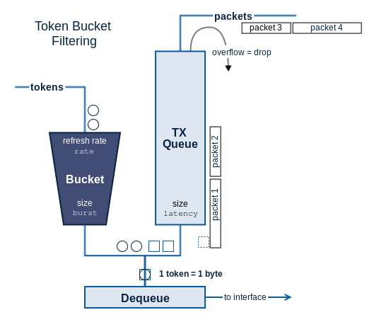
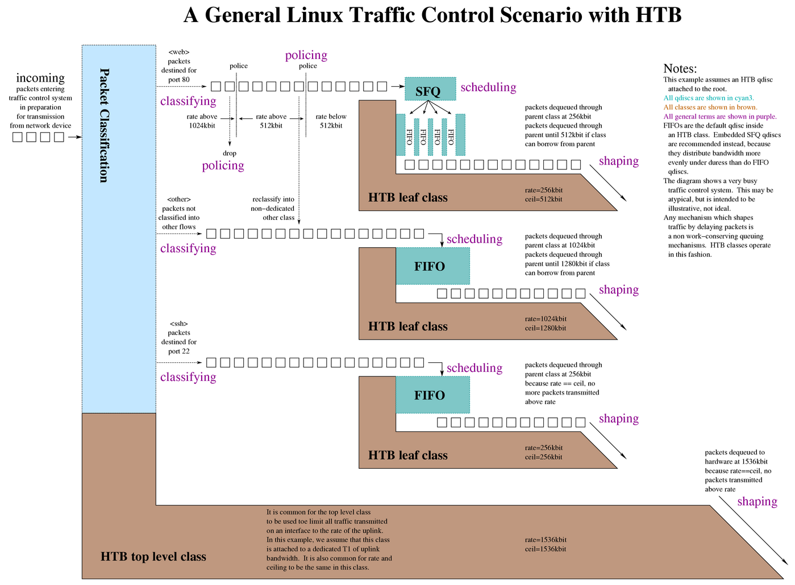
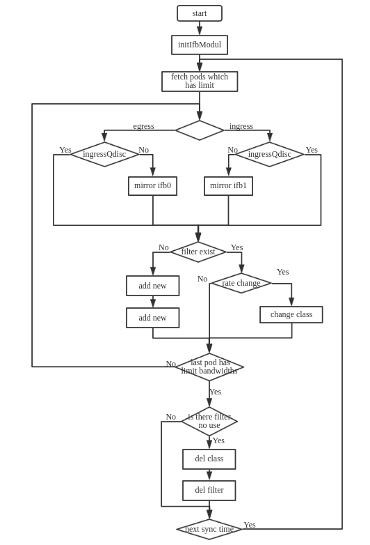

# 2.8 Traffic Control

## TC流量控制方式

- SHAPING 限制--流量被限制时，它的传输速率就被控制在某个值以下，限制阈值可以大大的小于有效带宽，这样可以平滑网络的突发流量，是网络更稳定，shaping适用于限制外出的流量。

- SCHEDULING 调度--通过调度数据包的传输，可以在带宽范围内按照优先级分配，也只适用于限制外出流量。

- POLICING 策略--用于处理接收到的数据

- DROPPING 丢弃--如果流量超过设置的带宽就丢弃数据包，向内向外皆管用。

## TC架构

Taffic Control是Linux的流量控制模块,他的基本原理是为网络设备建立队列规则。这个队列规则决定了哪些网络数包可以以何种速率被网络设备发送或接受（即数据包的发送方式）,从而实现对网络设备流量的控制操作。

tc 命令如下：
```sh
$ tc help
Usage: tc [ OPTIONS ] OBJECT { COMMAND | help }
       tc [-force] -batch filename
where  OBJECT := { qdisc | class | filter | action | monitor | exec }
       OPTIONS := { -s[tatistics] | -d[etails] | -r[aw] | -p[retty] | -b[atch] [filename] | -n[etns] name |
                    -nm | -nam[es] | { -cf | -conf } path }
```

Linux中网络数据流量分为入口(Ingress)部分和出口(Egress)部分，入口部分主要用于进行入口流量限速(policing)，出口部分主要用于队列调度(queuing scheduling)。

大多数队列规则(qdisc)都是用于输出方向的，输入方向只有一个排队规则，即ingress qdisc。ingress qdisc本身的功能很有限（因为没有缓存只能实现流量的drop）。但可重定向incoming packets，通过Ingress qdisc把输入方向的数据包重定向到虚拟设备ifb，而ifb的输出方向可以配置多种qdisc，就可以达到对输入方向的流量做队列调度的目的。


TC主要包括三个对象，分别是：qdisc-排队规则、class-类别、filter-过滤器


### qdisc
qdisc是流量控制的基础，无论何时，内核如果需要通过某个网络接口发送数据包，它都需要按照该接口配置的qdisc把数据包加入队列中。内核会尽可能多的从qdisc中取出数据包，然后交给网络适配器进行处理。而qdisc又分为CLASSLESS qdisc--不可分类队列规则、CLASSFUL qdisc--分类队列规则。

#### 不可分类队列规则

无分类队列规则对进入网卡的数据流统一对待，不进行区分，无分类队列规则能够接受数据包并重新编排、延迟、丢包，它可以对网卡流量进行整形，但是不能细分各种情况，无类队列的算法主要有,TBF(Token BucketFilter,令牌桶过滤器)和SFQ(Stochastic FairnessQueueing,随机公平队列)。，无分类队列的流量整形手段主要是排序、限速、丢包。

##### pfifo_fast

最简单的qdsic，先进先出策略，同时pfifo_fast是默认的缺省qdisc。pfifo_fast只有一个limit参数用来设置队列长度，以数据包个数为单位.pfifo_fast包含三个波段，band0~band2，每个波段也使用先进先出策略，band0优先级最高，band2最低，如果band0中有数据包，系统就不会去处理band1的数据包，直到band0的数据包处理完。同理band1和band2。


##### SFQ

SFQ(Stochastic Fairness Queueing 随机公平队列 ) 是公平队列算法家族中的一个简单实现。它的精确性不如其它的方法，但实现了高度的公平，需要的计算量亦很少。

SFQ算法主要针对一个TCP会话或者UDP流。流量被分成相当多数量的FIFO队列中,每个队列对应一个会话 。数据按照简单轮转的方式发送,每个会话都按顺序得到发送机会。这种方式非常公平，保证了每一个会话都不会没其它会话所淹没。

SFQ 之所以被称为"随机", 是因为它并不是真的为每一个会话创建一个队列，而是使用一个散列算法 , 把所有的会话映射到有限的几个队列中去。因为使用了散列 , 所以可能多个会话分配在同一个队列里， 从而需要共享发包的机会, 也就是共享带宽。为了不让这种效应太明显 ,SFQ 会频繁地改变散列算法，以便把这种效应控制在几秒钟之内 ( 时间由参数设定 )。

>注 :SFQ只会发生在数据发生拥堵产生等待队列的网卡上。所以出口网卡若无等待队列,SFQ亦不起作用。

##### TBF

令牌桶过滤算法只允许以不超过事先设定的速率到来的数据包通过，但可能允许短暂突发流量朝过设定值 。
TBF很精确，对于网络和处理器的影响都很小，实现是针对数据的字节数进行的，而不是针对数据包进行 , 常用于网关限速。



TBF的实现在于一个缓冲器 ( 桶 ), 不断地被一些叫做"令牌"的虚拟数据以特定速率填充着(token rate)。桶最重要的参数就是它的大小，也就是它能够存储令牌的数量。每个到来的令牌从数据队列中收集一个数据包，然后从桶中被删除。这个算法关联到两个流上——令牌流和数据流，于是我们得到 3 种情景：
A. 数据流以等于令牌流的速率到达TBF。这种情况下 , 每个到来的数据包都能对应一个令牌 , 然后无延迟地通过队列 .
B. 数据流以小于令牌流的速度到达TBF。通过队列的数据包只消耗了一部分令牌，剩下的令牌会在桶里积累下来，直到桶被装满。剩下的令牌可以在需要以高于令牌流速率发送数据流的时候消耗掉，这种情况下会发生突发传输 .
C. 数据流以大于令牌流的速率到达 TBF. 这意味着桶里的令牌很快就会被耗尽。导致TBF中断一段时间，称为"越限"。如果数据包持续到来，将发生丢包。此种情况最重要，因为它可以用来对数据通过过滤器的速率进行整形。令牌的积累可以导致越限的数据进行短时间的突发传输而不必丢包 , 但是持续越限的话会导致传输延迟直至丢包。

```sh

# 控制eth1出口流量速率256kbit突发传输10k最大延迟50ms
#tc qd add dev eth1 root handle 1: tbf rate 256kbit burst 10000 latency 50ms

rate: 限制的传输速率用位来计算
latency: 确定了一个包在TBF中等待传输的最长等待时间
burst: 桶的大小,以字节计。指定了最多可以有多少个令牌能够即刻被使用
```
> 注 : 管理的带宽越大,需要的缓冲器就越大。在Intel体系上 ,10兆bit/s的速率需要至少10k字节的缓冲区才能达到期望的速率。缓冲区太小导致潜在的丢包。

#### 可分类队列规则

可分类队列规则是对进入网卡的数据包根据不同的需求以分类，数据包进入分类队列后，通过过滤器对数据包进行分类，过滤器返回一个决定，队列就根据这个返回的决定把数据包发送到相应的某一类队列中进行排队。每个子类可以再次使用他们的过滤器进行进一步的分类（递归），直到不需要分类为止，数据包才会进入相关类的队列中进行排队。

> 注 : 过滤器对数据包进行分类的工具 , 是从队列规定内部调用的.

##### CBQ

CBQ是Class Based Queueing的简写，它实现了一个丰富的连接共享类别结构，既有限制带宽能力又有带宽优先级管理能力。带宽限制是通过计算连接的空闲时间完成的，空闲时间的计算标准是数据包离队事件的频率和下层连接的带宽。

```sh
#tc qdisc add dev eth0 root handle 1: htb default 30 
#tc class add dev eth0 parent 1: classid 1:1 htb rate 6mbit burst 15k 
#tc class add dev eth0 parent 1:1 classid 1:10 htb rate 5mbit burst 15k 
#tc class add dev eth0 parent 1:1 classid 1:20 htb rate 3mbit ceil 6mbit burst 15k 
#tc class add dev eth0 parent 1:1 classid 1:30 htb rate 1kbit ceil 6mbit burst 15k 
#tc qdisc add dev eth0 parent 1:10 handle 10: sfq perturb 10 
#tc qdisc add dev eth0 parent 1:20 handle 20: sfq perturb 10 
#tc qdisc add dev eth0 parent 1:30 handle 30: sfq perturb 10 

# 添加过滤器 , 直接把流量导向相应的类
#U32="tc filter add dev eth0 protocol ip parent 1:0 prio 1 u32"
#$U32 match ip dport 80 0xffff flowid 1:10 
#$U32 match ip sport 25 0xffff flowid 1:20
```

##### HTB

HTB是Hierarchy Token Bucket(分层令牌桶算法)的简写，使用HTB可以很容易的保证每个类的带宽，同时也允许特定类可以突破上限，占用其他类等宽等。HTB通过TFB实现带宽限制，也可以为类划分优先级。



##### PRIO

使用PRIO qdisc可以很容易对流量进行优先级管理，只有属于高优先级类别的数据包全部发送完毕，才会发送属于低优先级类别的数据包。

```sh
# 此命令立即创建了类 : 1:1, 1:2, 1:3 ( 缺省三个子类 )
#tc qdisc add dev eth0 root handle 1: prio 

#tc qdisc add dev eth0 parent 1:1 handle 10: sfq 
#tc qdisc add dev eth0 parent 1:2 handle 20: tbf rate 20kbit buffer 1600 limit 3000 
#tc qdisc add dev eth0 parent 1:3 handle 30: sfq
```


### class

 一些qdisc可以包含一些类，不同的类中又可以包含更深入的qdisc，通过这些细分的qdisc可以为进入队列的数据包排队，通过设置各种类数据包的离队次序，可以设置网络数据流量的优先级。例如，我们要对不同的IP实施不同的流量控制策略，这时就需要用不同的类来控制。

### filter

filter用于为数据包分类，决定数据包进入何种qdisc队列。filter是在qdisc内部的。目前可用的过滤器有：u32、rsvp、fwmark等。

 

当一个数据包入队的时候, 每一个分支处都会咨询过滤器链如何进行下一步。典型的配置是在 1:1 处有一个过滤器把数据包交给12:, 然后12: 处的过滤器在把包交给12:2. 你可以把后一个过滤器同时放在1:1处 , 而得到效率的提高。

另外，你不能用过滤器把数据包向"上"送。而且，使用HTB的时候应该把所有的规则放到根上 。

>注 : 数据包只能向"下"进行入队操作 ! 只有出队的时候才会上到网卡所在的位置来。

类组成一个树，每个类都只有一个父类，却可以有多个子类，某些qdisc允许在运行时动态添加类，如cbq、htb，而有些qdisc在运行时不许动态添加类，如prio。允许动态添加类的qdisc可以有多个子类，由他们为数据包排队。每个类都有一个叶子qdisc，默认这个叶子qdisc使用pfifo的队列，当然也可以用其他队列替换，而且，这个qdisc可以再次包含其他类，但是每个类只能有一个叶子qdisc。当一个数据包进入一个qdisc时，可以使用三种方式为其分类：tc filters、Type of Service、skb->priority。但是并不是所有的qdisc都可以使用这三种方式。

```
#在10:节点添加一个过滤规则，优先权 1: 凡是去往22口(精确匹配）的IP数据包,发送到类10:1
#tc filter add dev eth0 protocol ip parent 10: prio 1 u32 match ip dport 22 0xffff flowid 10:1 

#在10:节点添加一个过滤规则，优先权 1: 凡是来自80口(精确匹配)的IP数据包，发送到类10:1 
#tc filter add dev eth0 protocol ip parent 10: prio 1 u32 match ip sport 80 0xffff flowid 10:1 

#在eth0上的10:节点添加一个过滤规则，它的优先权是2: 凡是上二句未匹配的IP数据包，发送到类10:2 
#tc filter add dev eth0 protocol ip parent 10: prio 2 flowid 10:2 

#去往4.3.2.1的包发送到类10:1
#tc filter add dev eth0 parent 10:0 protocol ip prio 1 u32 match ip dst 4.3.2.1/32 flowid 10:1 

#来自1.2.3.4的包发到类10:1 
#tc filter add dev eth0 parent 10:0 protocol ip prio 1 u32 match ip src 1.2.3.4/32 flowid 10:1 

#凡上二句未匹配的包送往10:2 
#tc filter add dev eth0 protocol ip parent 10: prio 2 flowid 10:2 

#可连续使用match,匹配来自1.2.3.4的80端口的数据包
#tc filter add dev eth0 parent 10:0 protocol ip prio 1 u32 match ip src 4.3.2.1/32 match 
ip sport 80 0xffff flowid 10:1
```

## ifb模块

ifb虚拟设备主要用于重定向packets。主要包含ifb0,ifb1两个虚拟设备。通过把输入，输出方向的数据包重定向到虚拟设备ifb，而ifb的输出方向可以配置多种qdisc，就可以达到对输入，输出方向的流量做队列调度的目的。

我们看一下ifb模块的使用：
```
ifb模块需要手动加载。
# modprobe ifb
启用虚拟设备ifb0。
# ip link set dev ifb0 up
使用ifb0做输入方向的重定向。
tc filter add dev eth0 parent fff: protocol ip u32 match u32 0 0 flowid 1:1 action mirred egress redirect dev ifb0
使用ifb0做输出方向的重定向。
tc filter add dev eth0 parent 1: protocol ip u32 match u32 0 0 flowid 1:1 action mirred 
```

## 应用实践

下图是对容器入口/出口流量进行限速的流程图：


配置结果：
```sh
出口流量控制：
[root@10 ~]# tc qd show dev ifb0
qdisc htb 1: root refcnt 2 r2q 10 default 30 direct_packets_stat 245565
[root@10 ~]# tc class show dev ifb0
class htb 1:1 root prio 0 rate 10000Kbit ceil 10000Kbit burst 1600b cburst 1600b 
[root@10 ~]# tc filter show dev ifb0
filter parent 1: protocol ip pref 1 u32 
filter parent 1: protocol ip pref 1 u32 fh 800: ht divisor 1 
filter parent 1: protocol ip pref 1 u32 fh 800::800 order 2048 key ht 800 bkt 0 flowid 1:1 match c0a8001c/ffffffff at 12
入口流量控制：
[root@10 ~]# tc qd show dev ifb1
qdisc htb 1: root refcnt 2 r2q 10 default 30 direct_packets_stat 0
[root@10 ~]# tc class show dev ifb1
class htb 1:1 root prio 0 rate 3000Kbit ceil 3000Kbit burst 1599b cburst 1599b 
[root@10 ~]# tc filter show dev ifb1
filter parent 1: protocol ip pref 1 u32 
filter parent 1: protocol ip pref 1 u32 fh 800: ht divisor 1 
filter parent 1: protocol ip pref 1 u32 fh 800::802 order 2050 key ht 800 bkt 0 flowid 1:1 match c0a8001c/ffffffff at 16
```

## 参考文档

* [1] https://www.ibm.com/developerworks/cn/linux/1412_xiehy_tc/
* [2] http://blog.csdn.net/dog250/article/details/40483627


