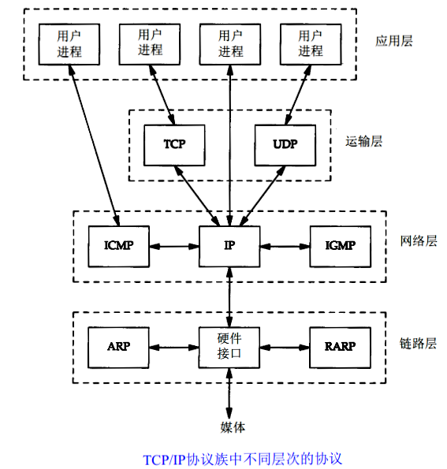
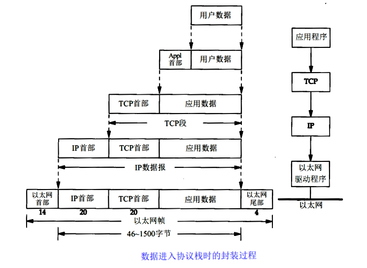
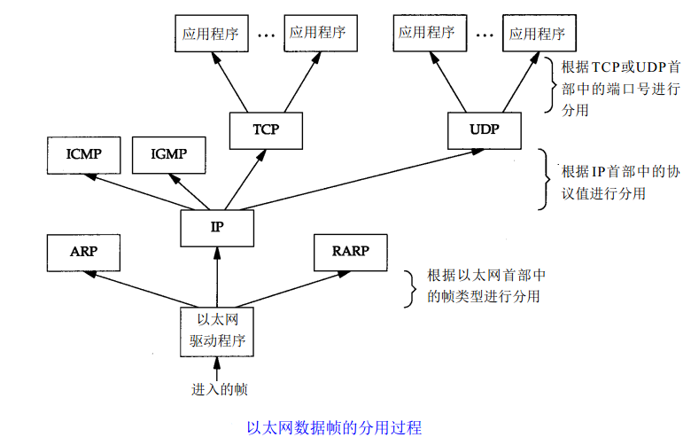
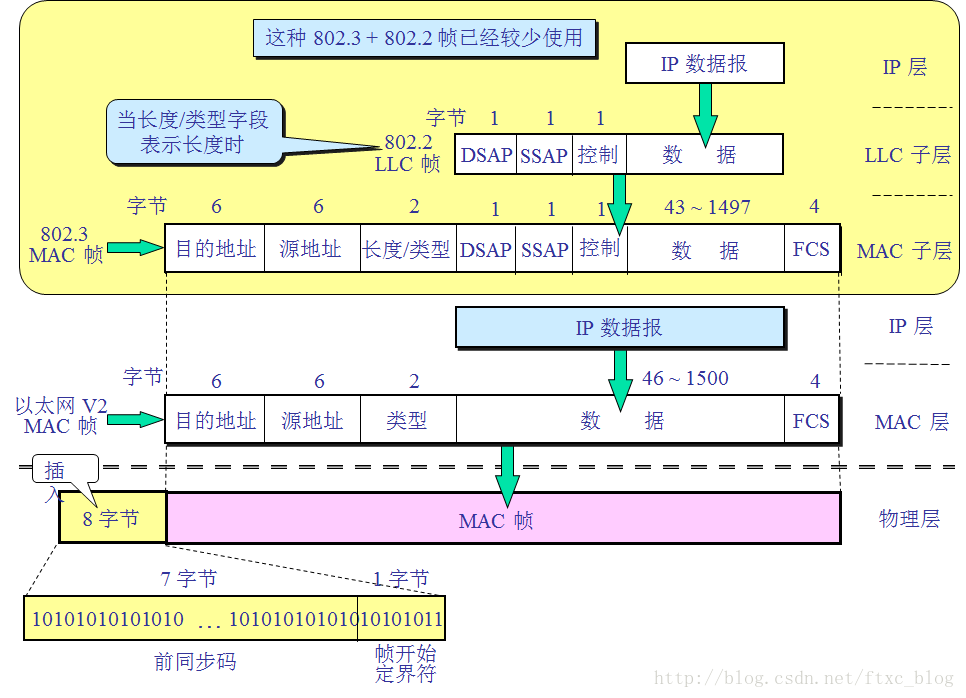
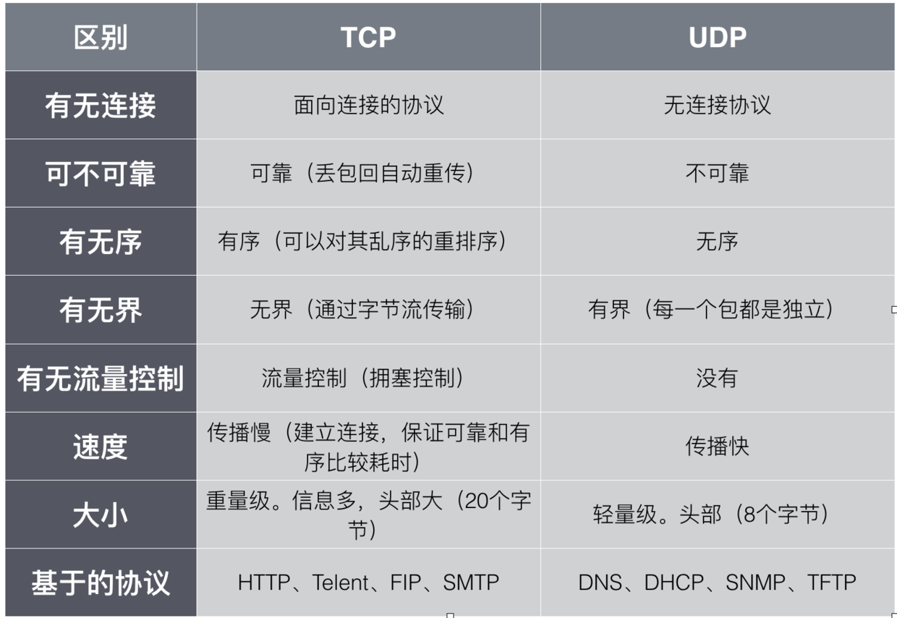

# 2.1 TCP/IP网络模型

> 注：本文主要参考自[wuyangchun](https://segmentfault.com/a/1190000008741770#articleHeader6)

## TCP/IP网络模型

TCP/IP协议模型（Transmission Control Protocol/Internet Protocol），包含了一系列构成互联网基础的网络协议，是Internet的核心协议，通过20多年的发展已日渐成熟，并被广泛应用于局域网和广域网中，目前已成为事实上的国际标准。TCP/IP协议簇是一组不同层次上的多个协议的组合，通常被认为是一个四层协议系统，与OSI的七层模型相对应。

ISO/OSI模型，即开放式通信系统互联参考模型（Open System Interconnection Reference Model），是国际标准化组织（ISO）提出的一个试图使各种计算机在世界范围内互连为网络的标准框架，简称OSI。由于其复杂性以及前期注重理论标准而错失了在工程应用抢占用户的时机。


下面主要讲解物理层以及TCP/IP协议里的4层结构：链路层、网络层、传输层和应用层

* 物理层：TCP/IP最底层负责数据传输的硬件。不管是有线还是无线的方式，都是让设备之间能交换数据。
* 链路层：也叫数据链路层或网络接口层，通常包括网络设备的驱动程序和计算机中对应的网络接口卡，它们一起处理与传输媒介的物理接口细节。负责封装和解封装IP报文，发送和接受ARP/RARP报文等。
* 网络层：主要包括IP、ICMP、IGMP三种协议。IP协议提供的是一种不可靠的服务，它只是尽可能快地把分组从源结点送到目的结点，但是并不提供任何可靠性保证。同时被TCP和UDP使用。TCP和UDP的每组数据都通过端系统和每个中间路由器中的IP层在互联网中进行传输的。ICMP是IP协议的附属协议，IP层用它来与其他主机或路由器交换错误报文和其他重要信息。IGMP是Internet组管理协议。它用来把一个UDP数据报多播到多个主机。
* 传输层：提供端到端的通信。包括TCP（传输控制协议）和UDP（用户数据报协议）两种协议。TCP为两台主机提供高可靠性的数据通信。它所做的工作包括把应用程序交给它的数据分成合适的小块交给下面的网络层，确认接收到的分组，设置发送后到确认分组的超时时钟等。由于运输层提供了高可靠性的端到端的通信，因此应用层可以忽略所有这些细节。为了提供可靠的服务，TCP采用了超时重传、发送和接收端到端的确认分组等机制。UDP则为应用层提供一种非常简单的服务。它只是把称作数据报的分组从一台主机发送到另一台主机，但并不保证该数据报能到达另一端。
* 应用层：负责处理应用程序的细节，包括HTTP、FTP、Telnet、DNS、SMTP等协议。



## 数据的封装与分用

在网络体系结构中网络通信的建立必须是在通信双方的对等层进行的。在整个数据传输过程中，数据在发送端时经过各层时都要附加上相应层的协议头和协议尾（仅数据链路层需要封装协议尾）部分，也就是要对数据进行协议封装，以标识对应层所用的通信协议。

TCP传给IP的数据单元称作TCP报文段或简称为TCP段（TCP segment）；UDP数据与TCP数据基本一致。唯一的不同是UDP传给IP的信息单元称作UDP数据报（UDP datagram），而且UDP的首部长为8字节。IP传给网络接口层的数据单元称作IP数据报(IP datagram)。通过以太网传输的比特流称作帧(Frame)。



而在接受端收到一个以太网数据帧时，数据就开始从协议栈中由底向上升，同时去掉各层协议加上的报文首部。每层协议盒都要去检查报文首部中的协议标识，以确定接收数据的上层协议。这个过程称作分用（Demultiplexing）。协议是通过目的端口号、源IP地址和源端口号进行解包的。



## 物理层

物理层是指TCP/IP最底层负责数据传输的硬件，这种硬件相当于以太网或电话线等物理层的设备。我们下面来看看物理设备直连间的通信：

如果我们只有一台设备，就不需要和别人通信。

两台直接弄根线连上就可以通信了。

三台可以像下面这样，三根网线搞定。
```
               +-------+
    +--------->| Node2 |<---------+
    |          +-------+          |
    |                             |
    ↓                             ↓
+-------+                     +-------+
| Node1 |<------------------->| Node3 |
+-------+                     +-------+
```
四台呢，这么连？
```

                +-------+
    +---------->| Node2 |<----------+
    |           +-------+           |
    |                               |
    ↓                               ↓
+-------+                       +-------+
| Node1 |                       | Node3 |
+-------+                       +-------+
    ↑                               ↑
    |                               |
    |           +-------+           |
    +---------->| Node4 |<----------+
                +-------+
```
虽然四根网线搞定，但带来至少两个问题：

Node2和Node4之间怎么通信？ 首先肯定得经过Node1或者Node3，就算能根据网络繁忙程度进行智能的选择，Node1和Node3也需要把部分精力用在帮忙转发数据包上，就算转发消耗的系统资源可以忽略不计，但Node1和Node3之间的通信呢？由于带宽有限，Node1和Node3之间的通信肯定会受Node2与Node4之间通信的影响。
Node2和Node4关机之后，Node1与Node3之间就没法通信了，也就是说如果这个环里面有两台设备下线，那么就会变成两个单独的网络
可以改进如下？全互联模式
```
                +-------+
    +---------->| Node2 |<----------+
    |           +-------+           |
    |               ↑               |
    ↓               |               ↓
+-------+           |           +-------+
| Node1 |<----------+---------->| Node3 |
+-------+           |           +-------+
    ↑               |               ↑
    |               ↓               |
    |           +-------+           |
    +---------->| Node4 |<----------+
                +-------+
```
全互联新的问题出现了： 四台机器总共是6根网线，看起来还好，但想象一下有10台机器，那就是55根，根本没法布线。

很明显这种只靠网线的办法在局域网中就行不通，更别说将世界上所有设备互联了。

于是人们想到引入一种新的设备，用来负责连接各个机器，机器只要和这个新的设备打交道就可以了（集中式），于是有了下面这样的连接方式：
```
                +-------+
                | Node2 |
                +-------+
                    ↑
                    |
                    ↓
               +--------+
+-------+      |        |      +-------+
| Node1 |<---->| Device |<---->| Node3 |
+-------+      |        |      +-------+
               +--------+
                    ↑
                    |
                    ↓
                +-------+
                | Node4 |
                +-------+
```
这样看起来就简洁多了，并且往这个网络中添加机器也非常简单，牵一根线到中心的那个设备就可以了。当然这样的组网也有缺点，那就是中心的那个设备挂了后，整个网络就不通了（单点故障），所以中心设备的功能一定要越简单越好，这样就能保证其稳定性。

其实上面的这两种连接方式就是我们常说的环形网络和星形网络，环形网络不常见，只在某些特殊场合使用，而星形网络就是我们现在常见的组网方式。

有了星形网络后，物理连接上没问题了，那么接下来的问题就是怎么通信，Node1要发数据给Node4，肯定要先发给中间的Device，那么Device怎么知道要发给Node4，而不是Node3呢？Node1和Node3都给Node4发数据，Node4怎么区分数据是谁发过来的呢？这时候链路层就登场了。

## 链路层

为了解决上面物理层遇到的问题，人们设计了一种链路层协议，叫以太网协议。

因为机器之间要通过网线通信，那么每台机器上都有一个处理数据传输的硬件，这个硬件就是网卡，在以太网协议中，要求每个网卡都要有一个地址，就是我们常说的网卡（mac）地址，并且这个地址必须唯一，不能冲突。

为了解决网卡地址唯一这个问题，人们将网卡地址拆成两个部分，第一部分是厂商的ID，另一部分由厂商自己控制，由于厂商的ID是唯一的，所以只要厂商自己不生产同样mac地址的网卡，那么所有厂商的网卡地址都将唯一。

有了mac地址后，Node1给Node4发的数据包中就可以带上各自的mac地址，这样就能唯一的标识这个包是由谁发给谁的了，这样的数据包就是以太网数据包，当然以太网协议还有其它的字段，但这两个字段是最重要的。

现在知道数据包是由谁发给谁的了，另一个问题来了，中心的那个Device收到Node1发给Node4的包之后，怎么知道Node4是连接到哪个端口上的呢？

最开始人们采用了一种简单粗暴的方法，那就是群发，由于中心的那个Device不知道Node4连接到哪个端口的，那么它就会将数据复制多份，向所有端口都发一份（Node1所在的端口除外，因为Device知道数据包是从这个端口发进来的），这样Node4就收到了Node1发过来的数据，当然其它两个Node也会收到相应的数据包，但网卡很老实，发现不是发给自己的数据包，就不看包里面的内容，直接把数据包丢弃了。

上面这种简单粗暴的设备就是我们常说的集线器（Hub），从它的工作方式我们可以看出它有两个缺点：

1. 数据不安全： Node1发给Node4的数据会被发送到Node2和Node3上去，虽然网卡默认情况下会丢弃该数据包，但是也可以设置网卡为混杂模式，从而可以接收并处理这些数据包。

2. 性能差： Node1跟Node4通信的所有数据包都要发给Node2和Node3一份，一方面增加Device的压力，并且还要占用和Node2及Node3之间的带宽.

为了解决集线器的问题，人们发明了交换机，跟集线器相比，交换机里面多了一张转发表，里面包含了mac地址和端口的对应关系，大概如下：

```
mac地址	端口
02:42:83:06:75:13	2
08:00:27:03:d0:e7	2
ee:35:41:bb:a4:60	3
02:42:34:8F:0E:FE	4
```

上表中，02:42:83:06:75:13和08:00:27:03:d0:e7连接在交换机的2号端口，ee:35:41:bb:a4:60连接到3号端口，02:42:34:8F:0E:FE连接到4号端口。

这里02:42:83:06:75:13和08:00:27:03:d0:e7都与端口2相连，表示与端口2连接的是一个交换机或者有多个虚拟网卡的主机。

有了这张表之后，交换机收到数据包之后，就知道要从哪个端口发出去了，于是解决了集线器的那两个问题，那么这里又有一个问题，这张表示从哪里来的？

交换机在刚启动时，这张表是空的，当收到第一个数据包的时候，它也不知道要从哪个端口转发出去，于是它采用和集线器一样的方式广播出去。当交换机每次从一个端口收到数据包时，都会提取数据包里面的源mac地址，然后将这个mac地址和端口的对应关系添加到（或者更新）转发表，这样很快就会将转发表构造起来，就算有网线换了端口，也会及时的更新转发表。

有了交换机后，局域网是搭建起来了，但是可以通过N个交换机将世界上的所有机器都连起来吗？就像下面这样：
```
                                +---------+
                                |         |        +-------+
                +-------+       | Switch3 |------->| Node5 |
                | Node2 |       |         |        +-------+
                +-------+       +---------+
                    ↑                ↑
                    |                |
                    ↓                ↓
               +---------+      +---------+      +---------+      +----------+
+-------+      |         |      |         |      |         |      |          |        +--------+
| Node1 |<---->| Switch1 |<---->| Switch2 |<---->| ....... |<---->| Switch N |------->| Node N |
+-------+      |         |      |         |      |         |      |          |        +--------+
               +---------+      +---------+      +---------+      +----------+
                    ↑                ↑
                    |                |
                    ↓                ↓
                +-------+        +-------+
                | Node3 |        | Node4 |
                +-------+        +-------+
```
答案是否定的。虽然每个Node都有一个唯一mac地址（UUID），但这个UUID里不包含任何其它信息，这给数据的全网传输带来了很大的问题。

想象一下我们每家每户都用一个UUID来标识，没有我们现在用的地址和邮编，那么把我家的地址给你，叫“912FAD50-07B2-4FBA-8F65-4537ABEF5670”，请问你要怎么找到我家？如果我们是一个村的人，那还不是特别难，村委会把所有住户的UUID都收集起来，找人的话去村委会问就行了。但是如果这个地址是另外一个国家的呢？那要把全球的所有UUID汇总起来，那么就有如下几个难题：
- 1.现在世界上联网的设备大概有几十亿，并且每年还在疯狂的增长。要有一个机制来管理所有的这些UUID，并且能高效的在里面找到想要的数据，这几乎是不可能的，交换机的转发表都会非常大，性能肯定跟不上的。
- 2.现在移动设备已经占据了很大的份额，位置老变来变去，意味着由UUID构成的网络拓扑结构老在发生变化，那怎么能保证及时的将地址变化情况更新到那些管理机构呢？估计光更新的请求就把网络给撑爆了。
- 3.没隐私，走到哪里都是那个UUID，都有人知道你在哪里，恐怖不？

所以在实际操作中这种办法根本不可行，就像邮局无法根据你提供的UUID找到你家地址一样。那看看我们真实的地址是怎么样的呢？ “湖南省长沙市岳麓区xxx路xxx号”一种层级结构的组织方式，我们就可以根据层级结构很快定位到具体地址。这就是下节我们要说的网络层的IP协议。

最后我们来看看链路层的一些协议以及术语：

1 以太网和802封装

以太网封装是以RFC894定义的
而802封装则是RFC1042定义的
主机需求RFC要求：
（1）必须支持以太网封装
（2）应该支持与RFC894混合的RFC1042封装
（3）或许可以发送RFC1042封装的分组



2 SLIP

适用于RS-232和高速调制解调器接入网络
（1）以0xC0结束
（2）对报文中的0xC0和ESC字符进行转义
缺点：没有办法通知本端IP到对端；没有类型字段；没有校验和

3 CSLIP

将SLIP报文中的20字节IP首部和20字节TCP首部压缩为3或5字节

4 PPP协议

修正了SLIP协议的缺陷，支持多种协议类型；带数据校验和；报文首部压缩；双方可以进行IP地址动态协商（使用IP协议）；链路控制协议可以对多个链路选项进行设置。

5 环回接口

用于同一台主机上的程序通过TCP／IP通信。
传给环回的数据均作为输入；
传给该主机IP地址的数据也是送到环回接口；
广播和多播数据先复制一份到环回接口，再送到以太网上。

6 MTU

对数据帧长度的最大限制，如果数据分组长度大于这个数值，需要在IP层对其分片。
注意：发往以太网的数据要考虑路径MTU

## 网络层

我们先看看IP地址的格式，如下图。


注：网络字节序：32bit传输的次序为0-7bit, 8-15bit, 16-23bit, 24-31bit（即big endian字节序）

网络层的IP地址就是上一节中类似于“湖南省长沙市岳麓区xxx路xxx号”的东西。那么IP地址是怎么来的呢？

### IP地址分配

首先我们来看看什么是子网掩码：

子网掩码用来确定多少bit用于网络号和多少bit用于主机号。
给定IP地址和子网掩码以后，主机就可以确定IP数据报的目的是：
(1)本子网上的主机；
(2)本网络中其他子网中的主机；
(3)其他网络上的主机。

根据子网掩码就可知道子网号与主机号之间的分界线。

知道了子网掩码，我们来看看实际的IP地址范围划分

- A类：地址范围1.0.0.1-126.255.255.255，A类IP地址的子网掩码为255.0.0.0，每个网络支持的最大主机数为256的3次方-2=16777214台。
- B类：地址范围128.0.0.1-191.255.255.255，B类IP地址的子网掩码为255.255.0.0，每个网络支持的最大主机数为256的2次方-2=65534台
- C类：地址范围192.0.1.1-223.255.255.255，C类IP地址的子网掩码为255.255.255.0，每个网络支持的最大主机数为256-2=254台
- D类：以1110开始的地址，多播地址
- E类：以11110开始的地址，保留地址

我们再来看看IP地址按照通讯模式的划分：

- 单播：目标是特定的主机，比如192.168.0.3
- 广播：目标IP地址的主机部分全为1，并且目的MAC地址为FF-FF-FF-FF-FF-FF。比如B类网络172.16.0.0的默认子网掩码为255.255.0.0，广播地址为172.16.255.255。
- 多播：目标为一组主机，IP地址范围为224.0.0.0～239.255.255.255。多播MAC地址以十六进制值01-00-5E打头，余下的6个十六进制位根据IP多播组地址的最后23位转换得到。

单播是对特定的主机进行数据传送。如给某一个主机发送IP数据包，链路层头部是非常具体的目的地址，对于以太网来说，就是网卡的MAC地址。广播和多播仅应用于UDP，它们对需将报文同时传往多个接收者的应用来说十分重要。

- 广播是针对某一个网络上的所有主机发包，这个网络可能是网络，可能是子网，还可能是所有的子网。如果是网络，例如A类网址的广播就是 netid.255.255.255，如果是子网，则是netid.netid.subnetid.255；如果是所有的子网（B类IP）则是 netid.netid.255.255。广播所用的MAC地址FF-FF-FF-FF-FF-FF。网络内所有的主机都会收到这个广播数据，网卡只要把MAC地址为FF-FF-FF-FF-FF-FF的数据交给内核就可以了。一般说来ARP，或者路由协议RIP应该是以广播的形式播发的。

- 多播就是给一组特定的主机（多播组）发送数据，这样数据的播发范围会小一些。多播的MAC地址是最高字节的低位为1，例如01-00-00-00-00-00。多播组的地址是D类IP，规定是224.0.0.0-239.255.255.255。与IP多播相对应的以太网地址范围从0 1 : 0 0 : 5 e : 0 0 : 0 0 : 0 0到01: 00: 5e: 7f: ff: ff。通过将其低位23 bit映射到相应以太网地址中便可实现多播组地址到以太网地址的转换。由于地址映射是不唯一的，因此要其他的协议实现额外的数据报过滤。

我们回过头来再看看生活中的地址，比如说湖南，为什么要叫这个名字，为什么管理的范围是现在这样？国家层面说了算（当然不是瞎说，根据历史情况来定），湖南下面要分几个市呢？湖南省自己进行划分。地址一旦规划好，就很稳定，很少变，变化的时候就是合并行政村、撤县设市、设置直辖市啊之类的。

IP地址也差不多，一旦分配好了就不会经常变化，比如给湖南分了那么多的IP段，那么就不会频繁的变化，一直都是湖南的；唯一不同的是生活中的地址没有长度限制，而IP地址有长度限制，IPv4的地址范围只有40亿左右（当时设计的时候觉得够用了，结果现在悲剧了，所以出现了IPV6）。

既然资源有限，那么就有分配的问题，先到先得，由于欧美发达，上网的人多，所以申请比较积极，抢去了大部分的地址空间，比如苹果公司分配到的IP地址为17.0.0.0/8一个“完整”的A类IP地址，可以代表1677万个主机，像非洲这样的，就只抢到很少的份额。而由于中国互联网起步较晚，分到的A类地址也是很少（没有一个完整的A类地址），大部分都是C类地址。同时地址分配机构也是一级一级的，比如我是中国电信公司，需要大批的IP，那么我就去向负责亚太地区的机构去申请，如果机构发现现在有多余的，就会直接分配地址给我，如果没有那么多，它会向它的上级要资源，所以这事和申请域名、通信频道是一样的，申请一定要积极，不然就被别人抢去了，等拿到分配给我的IP地址段后，就可以由省->市->县一级一级的往下再分配下去了，内部怎么分就看自己怎么管理了。


现在再去申请IPv4已经没戏了，2011年IPv4地址就被分配完了，现在该抢IPv6了，不过IPv6地址空间大，没必要那么急着抢，并且也不是谁都能申请，想申请多少就能申请多少的，只能按需申请，再说也不是免费的。

### IP路由

为了简化讨论，这里讨论的IP地址都是IPv4公网地址，不考虑内网地址，不考虑NAT转换的情况。同时由于网段的划分和路由是个很复杂的过程，在这里不讨论路由表是如何构造并更新的。
有了IP地址之后，我们就需要一个能转发IP数据包的设备，那就是路由器，有了路由器之后，我们的网络就变成了这样：
```
                                +---------+
                                |         |        +-------+
                +-------+       | Switch2 |<------>| Node4 |
                | Node2 |       |         |        +-------+
                +-------+       +---------+
                    ↑                ↑
                    |                |
                    ↓                ↓
               +---------+      +---------+      +---------+      +----------+        +---------+
+-------+      |         |      |         |      |         |      |          |        |         |       +--------+
| Node1 |<---->| Switch1 |<---->| Router1 |<---->| ....... |<---->| Router N |<------>| SwitchN |<----->| Node N |
+-------+      |         |      |         |      |         |      |          |        |         |       +--------+
               +---------+      +---------+      +---------+      +----------+        +---------+
                    ↑                                                                      ↑
                    |                                                                      |
                    ↓                                                                      ↓
                +-------+                                                              +----------+
                | Node3 |                                                              | Node N+1 |
                +-------+                                                              +----------+
```

有了IP地址后就很容易路由了，原理跟投递邮件一模一样，想象一下投递邮件，假设你在上海，要写一封信给北京的朋友，首先得找到最近的邮局，把信投进去，信封上会填上收件地址和发件地址，然后会有工作人员将信件发到下一站，下一站会有工作人员接手再发给下一站，经过几次中转到了上海总站，然后由上海总站再发往北京总站，北京总站再派工作人员一级一级的下发，最终将信件送到你朋友手上。

再来看看网络中的数据包，假设上海的A要给北京的B发一个数据包，首先得根据他自己的路由表（由自己配置）和B的地址，找到最近的路由器（这就跟上面找邮局是一样的，路由器就相当于邮局），路由器会根据它的路由表将数据包再往外发，可能是先到上海的某个中心路由器，然后再由它发给北京的路由器，最后由北京的路由器一级一级的往下发，最终到B的手中。

咋一看好像也是一级一级的转发，那跟前面被否决的链路层交换机的转发有什么不一样呢？

路由器里的路由表要小很多：IP是一段一段的有范围的，整个中国的IP段可能也就几百条，这几百条再被各个省分成不同的小的IP段，那么所有省一级的IP段总共加起来也差不多万条的级别，跟几十亿级的设备数量来比要小多了。并且IP范围和生活中的地址是一样的，不怎么变化，不需要频繁更新。
IP地址的位置是固定的，不需要频繁更新：移动设备就像是城市里的流动人口一样，人会经常租不同的房子，但房子本身的地址不会发生变化，就是说移动设备换地方后会换IP地址，但IP地址所关联的路由器是不会变化的，即IP地址在整个网络拓扑中的位置不会变化，变化的是设备的位置。
更好的隐私：由于大家都用IP通信，而IP没有和具体的设备绑定，给你一个IP地址，你只知道它大概位置在哪里，但你不知道用这个IP上网的设备是什么（当然可以通过其它的手段知道，但根据IP没法知道）。

大家都通过IP地址来通信，但交换机只知道链路层，不知道IP层的任何信息，于是设备在向另一个设备通过IP地址发送数据之前（通过交换机直接相连的两台机器），需要知道对方的mac地址，这个时候就用到了ARP协议，利用该协议，可以根据IP地址得到mac地址，当然，该协议只在局域网内有效，网络中的每台设备只和当前局域网的另一台设备直接通信，想要访问其它网络中的设备，需要当前网络中的其它设备代为转发，具备转发IP数据包功能的设备，我们就说它具有路由功能，一般就是我们常说的路由器。

IP网络这么好，那我们还需要链路层的网络吗？直接通过IP进行通信就好了，还要mac地址干嘛？答案是不行，还是得依赖链路层。因为IP地址是逻辑上的东西，所以就要考虑分配问题，一台设备加入了当前网络，给它分配个什么IP好呢？机器数量少且不怎么变化的情况下，可以人工管理，做到地址不冲突，但在公共场合呢？你去了机场，连了机场的网络，IP怎么办？机场工作人员给你找一个空闲的填上？就算机场有那闲功夫，专门派个人或者设备显示当前网络还有哪些IP是空闲的，你也烦啊，需要找到这个人或者设备，并且还要自己手动配置网络IP；再考虑一种情况，你坐在地铁上，从闵行区到杨浦区，中间要经过徐汇区，在闵行区的时候你手机是在闵行区的网络里，等地铁经过徐汇区的时候，你连上了徐汇区的网络，IP地址咋办，到哪去找一个没被人占用的IP地址？那么多的人，怎么保证不冲突？到了杨浦区的时候，又得人工切换，估计你都要崩溃了。所以网络层还是离不开链路层来完成一些它的管理工作。

我们来看看IP路由具体流程：

IP路由选择是逐跳进行的。IP并不知道到达任何目的的完整路径（当然，除了那些与主机直接相连的）。所有的IP路由选择只为数据报传输提供下一站路由器的IP地址。它假定下一站路由器比发送数据报的主机更接近目的，而且下一站路由器与该主机是直接相连的。

路由选路按照1,2,3依次匹配：

1. 全匹配，寻找能与目的IP地址完全匹配的表目（网络号和主机号都要匹配）。如果找到，则把报文发送给该表目指定的下一站路由器或直接连接的网络接口（取决于标志字段的值）。

2. 部分匹配，寻找能与目的网络号相匹配的表目。如果找到，则把报文发送给该表目指定的下一站路由器或直接连接的网络接口（取决于标志字段的值）。目的网络上的所有主机都可以通过这个表目来处置。例如，一个以太网上的所有主机都是通过这种表目进行寻径的。这种搜索网络的匹配方法必须考虑可能的子网掩码。关于这一点我们在下一节中进行讨论。

3. 使用默认值，寻找标为“默认”的表目。如果找到，则把报文发送给该表目指定的下一站路由器。

如果上面这些步骤都没有成功，那么该数据报就不能被传送。如果不能传送的数据报来自本机，那么一般会向生成数据报的应用程序返回一个“主机不可达”或“网络不可达”的错误。

IP路由选择是通过逐跳来实现的。数据报在各站的传输过程中目的IP地址始终不变，但是封装和目的链路层地址（mac）在每一站都可以改变。大多数的主机和许多路由器对于非本地网络的数据报都使用默认的下一站路由器。

IP路由选择机制的两个特征：
（1）完整主机地址匹配在网络号匹配之前执行
（2）为网络指定路由，而不必为每个主机指定路由

### IP冲突和动态分配

有了ARP后，系统在手工设置自己的IP之前，可以通过ARP请求来问问当前局域网里面有没有同样IP的机器，这样就可以有效的避免IP冲突。

同时为了动态的分配IP，人们想出了DHCP协议，大概过程就是，当一个机器连进网络的时候，先广播一下，问当前局域网有没有人可以分配一个IP给它，当前网络中的DHCP服务器收到请求后就会分配一个空闲的IP给请求的机器，应答包中还包含了子网掩码和默认网关。有几个问题需要注意：

由于当前机器没有IP，所以只能依靠链路层的广播机制，所以它的范围局限于当前局域网(当然局域网的其它设备也可以转发该DHCP请求出去，从而实现跨网段的DHCP)
当前局域网只能有一个DHCP服务器，否则两个服务器管理的地址可能冲突
在有DHCP服务器的网络中也可以手动的给自己配置IP，只要不使用被DHCP服务器管理的IP范围，并且不和别人冲突就可以了。

### IP地址合理利用

- 1.子网划分：借用主机号的高若干位来充当子网地址，从而将原网络划分成若干子网。 举个例子，假设有一个公司，这个公司有两个部门：位于北京总部和位于上海的分部，两个部门分别有100台电脑。这个公司申请C类IP的时候，不需要申请两个IP，而是只需要申请一个IP地址就行了，假设是201.102.123.0。子网掩码设定为255.255.255.128就可以把一个C类IP地址划分为两个子网：201.102.123.0 - 201.102.123.127 和201.102.123.128-201.102.123.255。 这样的话北京和上海分别使用同一个C类IP地址的两个不同子网。如果没有子网划分技术的话，北京和上海就需要分别申请两个不同的C类IP，这就造成了IP浪费。 
- 2.私有地址的使用。与可以Internet使用的公网IP地址不同，私有IP地址是特定只能在局域网中使用的IP地址。私有地址分为三类，A类是10.x.x.x，B类是172.16.x.x，C类是192.168.x.x。假设你向电信申请了一个C类IP公有地址，那么你可以自己组建一个无线局域网（wifi），你可以组建A类、B类、C类私有网三者中任意一个。不过，一般而言，都是组建C类私有网。私有地址需要转换成公有地址才能够“出去”，这项技术叫做NAT链接。私有地址的使用，可以让很多人同时使用一个公有IP地址。 
- 3.动态IP。每一次上网，都临时分配一个IP地址，往往每次分配的IP地址都不同。很多人上网的时间和空间是“离散”的，不连续。比如，一个人一天上了3次网，每一次1个小时。那么如果给这个人分配一个固定的IP地址，那么是极其浪费的，因为一天24个小时中，只有3个小时得到了利用。如果采取动态分配IP的方法，只是在上网的时候临时分配一个IP地址。这样同一个IP地址可以在同一天之内被多个人使用。假设每一个每天上3个小时的网，那么一个IP地址最理想可以同时供8个人使用。这样，一个IP地址在不同时间段分给不同人使用。

IP层解决了将一个包从一地址发到另一个地址的问题，但这个数据包是给谁的呢（比如学校的地址有上万人呢）？这时候就靠传输层了。

## 传输层

在生活中，一个地址可能是一个家庭住址，或者是一个学校，邮件中除了包含收件地址和发件地址之外，还需要收件人和寄件人的信息，因为只有有了收件人的名字，才知道把邮件交到谁的手上。

网络世界中也一样，网络（IP）层负责将数据包发到目的地址，但这个数据包是给谁的呢？机器上运行那么多的进程，哪一个才是接收者呢？就需要一个东西来区分这些进程，于是就有了端口的概念，如果进程需要网络通信，就向操作系统申请一个端口，通过这个端口来唯一标识这个进程。

注意：端口是个抽象的逻辑概念，并不是说机器上有那么多的硬件端口。
这个时候UDP就登场了，它在IP协议的基础上增加了源端口和目的端口字段，这样一个UDP包就能唯一的确定是从哪台设备的哪个进程发给哪台设备的哪个进程。

有了UDP，就能将包发送给指定设备上的进程，目的进程也能通过收到数据包中的源地址和端口，发送应答包回去。那这样是不是就搞定了呢？

想想发邮件，是不是有邮件丢失的情况，丢失了会怎么样？丢失后造成的情况是接收方没收到邮件，发送方也不知道邮件丢了。为了应对这种情况，邮局推出了挂号信，就是如果邮件丢失，会通知发送方。

UDP也有这样的问题，当线路繁忙的时候，路由器如果处理不过来就会将收到的包丢弃，这时目的端收不到数据包，发送端也不知道数据包丢了，于是造成通信故障。这个时候TCP就登场了，它在里面增加了一些收包确认及超时重传的机制，保证数据包能完整的发送到目的地。

就如同挂号信比平邮要贵一样，TCP要比UDP的开销大，所以对于可以接受丢包的场合，UDP还是有一席之地。

TCP与UDP的详细区别见下表：




通过传输层，数据包已经完整的发送到了接收进程手中，那么数据包里面包含了什么数据呢？应该怎么解析它呢？这时候就的看应用层了。

## 应用层

想想邮件，收件人收到之后打开邮件会看到什么？可能是一封普通的问候信，也可能是一首诗，有可能是中文的，也有可能是英文的。总之要有一定的格式，并且是收件人能看懂的格式，否则这封信就没有任何意义。

同样的，收到数据包的进程打开数据包之后也需要能看懂数据包的内容，不然该数据包就没有任何意义，数据包的数据要能被看懂，那就得必须有固定的格式，这种格式就是我们常说的应用层协议，如ftp、http、dns、snmp等。发送方必须发送接收方能识别的协议格式，比如向http服务器只能发送http请求，如果发ftp请求过去的话，http服务器就不认得，没法处理，只能返回错误。

数据发到目的进程手上了，目的进程也能看懂数据的内容，于是一个成功的通信过程就完成了。

## 完整的通信过程

这里以一个dns请求为例，描述一下数据包的传输过程，因为dns默认是udp协议，所以比较直观。

假设dns服务器的IP是8.8.8.8，端口是53

1. 应用层构造一个DNS包，然后告诉UDP层发到8.8.8.8的53端口
2. UDP层收到包后，构造一个UDP包，里面的数据就是DNS包的内容，目的端口是53，源端口由操作系统分配一个（或者可以通过绑定的方式自己指定一个），然后告诉IP层让它把这个UDP包发给8.8.8.8
3. IP层收到请求后，就去查询路由表，看这个包应该怎么出去
4. 在这种情况下，由于8.8.8.8跟自己不在一个子网，于是会找到默认网关的IP，同时得到自己应该用哪个IP及哪个网卡发包出去；这里假设我们只有一个网卡eth0，IP为192.160.64.12。
5. 构造一个IP包，里面的数据是UDP的内容，目的IP是8.8.8.8，源IP为192.160.64.12
6. 构造ARP数据包，源地址为eth0的mac地址，目的地址为链路层广播地址，广播局域网，获得网关IP对应的mac地址
7. 通知链路层将这个IP包发给网关对应的mac地址
8. 链路层收到请求后，构造以太网包，目的地址为网关的mac地址，源地址为eth0的mac地址，内容为上面构造的IP包，然后发送给网关
9. 网关收到数据包后，一看目的IP是8.8.8.8，跟自己不在一个子网，于是就查看自己的路由表，然后将数据包发给下一个路由器（发给下一个路由器的过程和上面的6~8步相同）
10. 直到这个数据包到了最后一个路由器，该路由器发现8.8.8.8跟它其中的一块网卡在同一个子网，于是通过那块网卡直接发给8.8.8.8（发给8.8.8.8的过程和上面6~8步中发给网关的过程相同，只是目的地由网关变成了8.8.8.8）
11. 8.8.8.8收到数据包一看，发给53端口的，于是就转给了DNS服务器进程
12. DNS服务器进程读取包的内容后，构造应答包，然后根据源IP和源端口，跟请求包一样的流程，将应答包发给了请求方

> 系统有ARP表，会将查到的IP地址同mac地址的对应关系缓存起来，所以上面的过程中并不是每次都要发ARP包


## 参考文档

* [1] https://segmentfault.com/a/1190000008741770#articleHeader6
* [2] https://feisky.gitbooks.io/sdn/basic/tcpip.html
* [3] http://blog.csdn.net/aaa_aa000/article/details/46647303